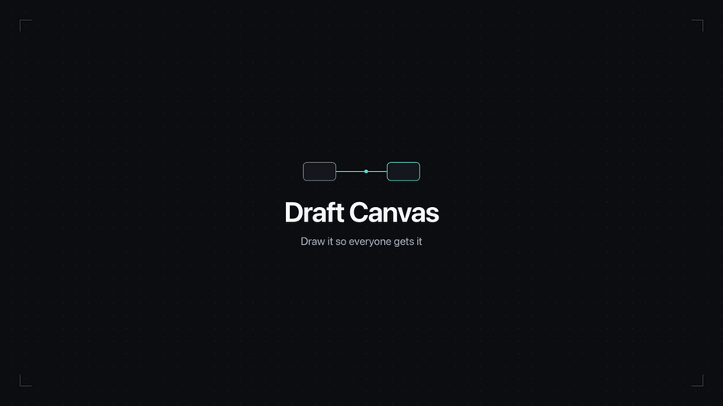

# Draft Canvas

You're in a meeting explaining a system. Someone needs to see it drawn.

So you start diagramming. Then you're adjusting connectors, moving things around, working out how to represent what you're talking about. Before long, you're spending more time making the diagram than explaining the idea.

**Draft Canvas is built to reduce that friction.**

It gives you architecture-aware shapes, familiar technical relationships, and small assists where they help: enough to spend less time wrestling with the diagram and more time explaining the system.

[](https://github.com/acltabontabon/draft-canvas/actions/workflows/ci.yml)
[](LICENSE)
[](https://hub.docker.com/r/acltabontabon/draft-canvas)
[](https://marketplace.visualstudio.com/items?itemName=acltabontabon.draft-canvas)
[](https://github.com/acltabontabon/draft-canvas/releases)



**[Try it →](https://acltabontabon.com/draft-canvas/)** Nothing you draw leaves your browser.

Also lives [in VS Code](#in-vs-code), next to your code, and [in Docker](#running-it-yourself), on your own server.

**Documentation:** [Getting started](docs/guides/getting-started.md) ·
[All guides](docs/index.md) ·
[Keyboard shortcuts](docs/guides/keyboard-and-commands.md) ·
[Saving and sharing](docs/guides/saving-and-sharing.md) ·
[Contributing](CONTRIBUTING.md)

---

## What it does

- **Architecture-aware shapes**: Service, Data Store, Queue/Topic, Actor and Boundary know what they mean, so connectors label themselves (*publishes to*, *reads from*) and the app can suggest a sensible next shape
- **C4-aware depth**: look inside a Service or Component to draw what runs there, and [explain a system at different levels](docs/guides/depth.md)
- **Flows and presentations**: group connectors into a flow and present it one step at a time; export a flow as a Mermaid or PlantUML sequence diagram
- **Keyboard-first**: press a letter to drop a shape, `Tab` to accept a suggestion, `⌘K` for everything else
- **Starters**: compose a known architecture from the command palette: Monolith, Microservices, Event-Driven, Hexagonal, CQRS, Saga, Outbox, Medallion and more
- **Local by default**: diagrams are saved in your browser (IndexedDB) and encrypted at rest; no backend and no account. It works offline once loaded, and a build-time test fails on any network call in the app's code
- **Export**: editable `.draftcanvas` JSON, passphrase-encrypted `.dcenc`, PNG, SVG, GIF, and Mermaid or PlantUML source

Diagrams live in one browser on one device. [Export anything you'd mind losing](docs/guides/saving-and-sharing.md#what-you-have-to-do).

---

## Try it

The quickest way is the [hosted app](https://acltabontabon.com/draft-canvas/). Press **New canvas**, then `S` to drop a service under your cursor. [Getting started](docs/guides/getting-started.md) takes you from there to a presented, exported diagram.

Or run it from source:

```bash
git clone https://github.com/acltabontabon/draft-canvas.git
cd draft-canvas
npm install
npm run dev        # http://localhost:5180
```

---

## In VS Code

Keep the diagram next to the code it describes.

```text
payments-service/
├── src/
└── docs/
    └── architecture/
        └── checkout.draftcanvas   ← click it, you're on the canvas
```

Install [Draft Canvas for VS Code](https://marketplace.visualstudio.com/items?itemName=acltabontabon.draft-canvas),
open any `.draftcanvas` file, draw, and `⌘S`. The diagram saves back to that file as plain JSON, so
it shows up in a pull request like everything else. `Draft Canvas: New Diagram` starts a fresh one.
More in [Working with `.draftcanvas` files in VS Code](docs/guides/vscode.md).

---

## Running it yourself

The same static app as the hosted version, served by nginx. No backend, nothing to configure.

```bash
docker run -d --name draft-canvas -p 8080:80 acltabontabon/draft-canvas
```

Then open http://localhost:8080. `latest` follows stable releases; pin a tag like
`acltabontabon/draft-canvas:1.9.0` to stay put.

Serving it to other machines? Put it behind HTTPS. Browsers only allow the encryption Draft Canvas
saves with on HTTPS or `localhost`, so over plain `http://192.168.x.x` it can't save anything.

---

<!-- performance:start -->
## Performance

On a typical architecture diagram (~90 nodes — services, databases, queues, boundaries), Draft Canvas loads in about 478 ms and settles at about 17 MiB of memory. A larger, more detailed diagram (~225 nodes) loads in about 747 ms and uses about 32 MiB.

| Diagram | Size | Load time | Memory (JS heap) |
|---|---|---|---|
| Typical | 90 nodes / 79 connections | 478 ms | 17 MiB |
| Large | 225 nodes / 192 connections | 747 ms | 32 MiB |

Measured on: Apple M2 Pro, macOS 27.0.0, Chromium 153.0.8010.12, Draft Canvas 1.8.0. Reference-machine numbers on real architecture diagrams, not a guarantee for every device.

Frame times while you pan, zoom and drag in diagrams of up to 1,000 shapes, how long big diagrams take to open, and how to reproduce all of it: [`docs/reference/performance.md`](docs/reference/performance.md).
<!-- performance:end -->

---

## Contributing

Draft Canvas is small and opinionated. [`CONTRIBUTING.md`](CONTRIBUTING.md) covers setup, the checks
to run, and what kinds of change fit; [`docs/reference/architecture.md`](docs/reference/architecture.md)
explains why it is built the way it is. Security concerns: [`SECURITY.md`](SECURITY.md). Release notes:
[`CHANGELOG.md`](CHANGELOG.md).

Draft Canvas is licensed under [Apache 2.0](LICENSE).
