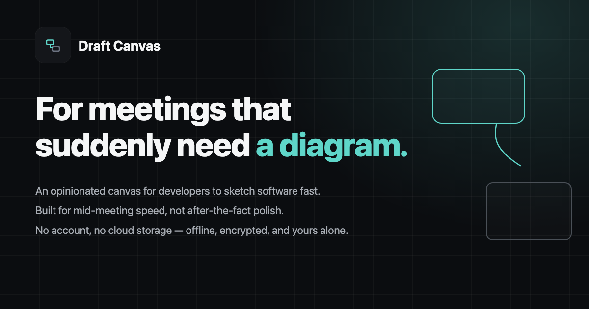
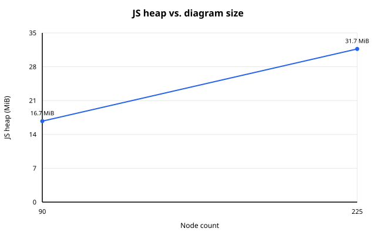

# Draft Canvas

An opinionated diagramming tool for devs to sketch fast when a meeting suddenly needs a diagram. No cloud, no account — just draw. Draft Canvas understands architecture: it nudges you toward sensible connections and exports pixel-perfect SVG, PNG, or GIF.

**[Try it →](https://acltabontabon.com/draft-canvas/)** Nothing you draw leaves your browser.

## How it works

**Draw** — Double-click to create shapes (text, notes, services, components, databases, queues,
actors). Drag from an edge to connect; drop on empty canvas and the target node appears.

**Start** — ⌘K, then "microservices", "modular monolith", "event driven", "hexagonal",
"monolith", "backend for frontend", "cqrs", "saga" or "outbox" drops in a composed starting diagram
for that architecture or pattern — laid out, labelled, and ready to change. Ordinary shapes and connectors, so nothing is locked; one undo removes it all.

**Code** — Syntax-highlighted cards for Java, JSON, YAML, XML, SQL, shell, HTTP, log. Read-only,
not an editor.

**Flows** — Name an ordered path through connectors you've already drawn. Reuse the same diagram
for multiple scenarios. Export any Flow as an animated GIF.

**Present** — Step through a Flow, one connector at a time. Active connector and endpoints stay
lit; everything else quiets. Arrow keys navigate.

**Details** — Mark connectors async (dashed line). Add free-text condition chips. Attach notes or
code snippets. Save automatically to the browser.

**Export** — `.draftcanvas` (portable JSON), `.dcenc` (passphrase-protected), PNG, SVG, or GIF.

## Why local-first

Your diagrams stay on your device. No account. No backend. No sync.

This is enforced, not a promise: the build fails if `fetch`, `XMLHttpRequest`, WebSocket, or
analytics code appear anywhere. The production CSP blocks any request to another origin. A Service
Worker caches the app itself; it never touches your diagrams.

See [docs/PRIVACY.md](docs/PRIVACY.md) for what's stored where.

⚠️ **Clearing your browser's site data deletes your diagrams.** Export a `.draftcanvas` file
for anything you want to keep.

## Docs

- [Architecture](docs/ARCHITECTURE.md) — how it works and why
- [Diagram semantics](docs/SEMANTICS.md) — what it understands about your diagrams
- [Schema and versioning](docs/SCHEMA.md) — the `.draftcanvas` format and its migration contract
- [Privacy](docs/PRIVACY.md) — what's stored where
- [Performance](docs/performance.md) — the benchmark, what it measures, and how to run it
- [Contributing](CONTRIBUTING.md) — how to run it locally

<!-- performance:start -->
## Performance

Draft Canvas includes a reproducible Chromium benchmark using a representative architecture diagram.

| Scenario | Elements | Load | JS Heap | Drag |
|---|---|---|---|---|
| Typical | 90 nodes / 79 connections | 151 ms | 15 MiB | 366 ms |
| Large | 225 nodes / 192 connections | 502 ms | 29 MiB | 385 ms |

Benchmarks run against the production build in Chromium using deterministic architecture diagrams. Results are representative measurements from the reference machine below, not guarantees for every device.

Measured on: Apple M2 Pro, darwin 25.6.0, Chromium 151.0.7922.34, Draft Canvas 0.8.0.

Details and reproduction steps: [`docs/performance.md`](docs/performance.md).
<!-- performance:end -->

## Contributing

Bugs, features, and PRs welcome. See [CONTRIBUTING.md](CONTRIBUTING.md). Follows a standard
[Code of Conduct](CODE_OF_CONDUCT.md).
