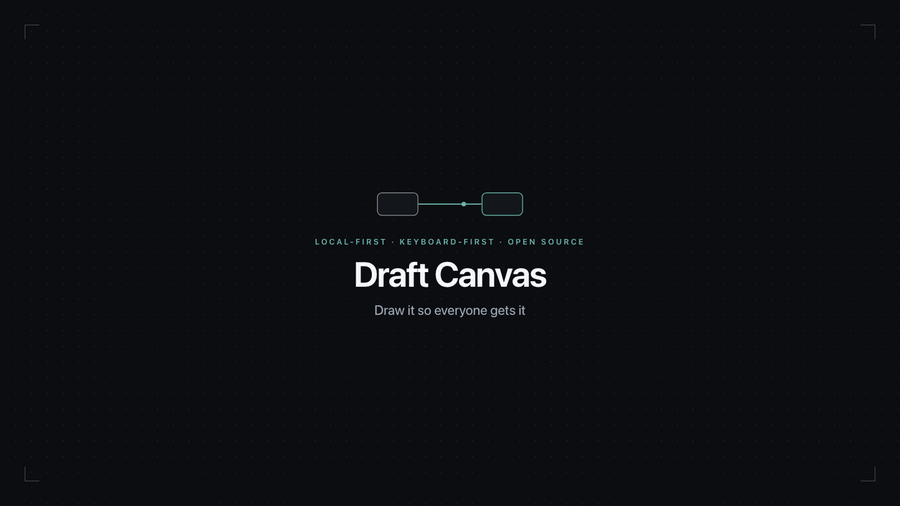
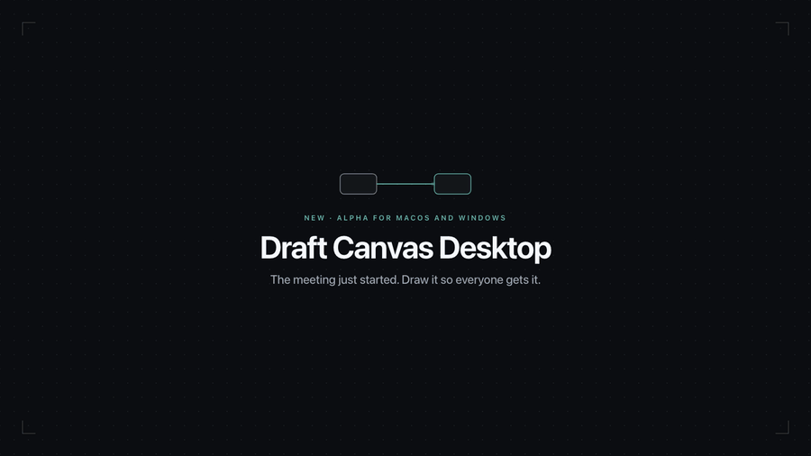

# Draft Canvas

You're in a meeting explaining a system. Someone needs to see it drawn.

So you start diagramming. Then you're adjusting connectors, moving things around, working out how to represent what you're talking about. Before long, you're spending more time making the diagram than explaining the idea.

**Draft Canvas is built to reduce that friction.**

It gives you architecture-aware shapes, familiar technical relationships, and small assists where they help: enough to spend less time wrestling with the diagram and more time explaining the system.

[](https://github.com/acltabontabon/draft-canvas/actions/workflows/ci.yml)
[](LICENSE)
[](https://hub.docker.com/r/acltabontabon/draft-canvas)
[](https://github.com/acltabontabon/draft-canvas/releases)



**[Try it →](https://acltabontabon.com/draft-canvas/editor/)** Nothing you draw leaves your browser.
There's a [landing page](https://acltabontabon.com/draft-canvas/) too, if you'd rather read about it first.

Also lives [on your desktop](#desktop), in a window of its own with your diagrams as files, and
[in Docker](#running-it-yourself), on your own server.

**Documentation:** [Getting started](docs/guides/getting-started.md) ·
[All guides](docs/index.md) ·
[Keyboard shortcuts](docs/guides/keyboard-and-commands.md) ·
[Saving and sharing](docs/guides/saving-and-sharing.md) ·
[Contributing](CONTRIBUTING.md)

---

## What it does

- **Architecture-aware shapes**: Service, Data Store, Queue/Topic/Stream, Actor and Boundary know what they mean, so connectors label themselves in the arrow's direction (*reads / writes*, *sends command to*, *consumed by*) and the app can suggest a sensible next shape
- **C4-aware depth**: look inside a Service or Component to draw what runs there, and [explain a system at different levels](docs/guides/depth.md)
- **Flows and presentations**: trace connectors in the order you want to explain them, then present the flow one step at a time; explore an editable Order processing example, move between flows, and export Mermaid or PlantUML sequence diagrams
- **Tidy a selected area**: arrange selected shapes and boundary contents without moving their neighbors; fit existing small shapes to their full names in one undo step
- **Keyboard-first**: press a letter to drop a shape and type its name, `Tab` to accept a suggestion, `⌘K` for everything else, `⌥O` for an Outline a screen reader can follow
- **Starters**: begin from a composed architecture — Monolith, Microservices, Event-Driven, Hexagonal or CQRS up front, [eight more](docs/guides/examples.md) by name in the command palette
- **Local by default**: browser diagrams auto-save to IndexedDB; Import and Export move portable files in and out. No backend or account; works offline once loaded. A test fails on any network API in the editor's source ([what's stored, and where](docs/reference/privacy.md))
- **In and out**: paste or drop a Mermaid flowchart to start from one; export editable `.draftcanvas` JSON, passphrase-encrypted `.dcenc`, PNG and SVG (which can carry the diagram inside), Mermaid and PlantUML sequence diagrams, and the architecture as a Mermaid flowchart, C4-PlantUML, Structurizr or draw.io — or copy any of them straight to the clipboard
- **Share without a server**: a read-only link carries the whole diagram in the address and can start at a chosen level or flow introduction; nothing is uploaded
- **Back up and restore** every diagram in a browser as one zip

Diagrams live in one browser on one device. [Export anything you'd mind losing](docs/guides/saving-and-sharing.md#what-you-have-to-do).

---

## Where it runs

One editor, two places to use it — the browser and the desktop — and a Docker image of the web app for
your own server. All three share a version and ship together in each
[release](https://github.com/acltabontabon/draft-canvas/releases).

| | Runs on | Saves to | Status |
| --- | --- | --- | --- |
| [Web app](https://acltabontabon.com/draft-canvas/editor/) | A modern browser | The browser (IndexedDB); Export creates a portable file | Stable |
| [Docker](#running-it-yourself) | Your own server, behind HTTPS | The visitor's browser, as above | Stable |
| [Desktop](#desktop) | macOS (Apple Silicon, Intel), Windows x64 | `.draftcanvas` files and folders | Stable, with unsigned installers; `desktop-v…-alpha`/`-beta` tags are previews that never replace a stable install |

There's no Linux desktop build. Nothing is synced between them; a `.draftcanvas` file is how a
diagram moves. Ideas and planned work are in [Issues](https://github.com/acltabontabon/draft-canvas/issues).

---

## Try it

The quickest way is the [hosted app](https://acltabontabon.com/draft-canvas/editor/). Press **New canvas**, then `S` to drop a service under your cursor. [Getting started](docs/guides/getting-started.md) takes you from there to a presented, exported diagram.

Or run it from source:

```bash
git clone https://github.com/acltabontabon/draft-canvas.git
cd draft-canvas
npm install
npm run dev        # http://localhost:5180
```

---

## Draft Canvas for VS Code has been retired

The extension that opened `.draftcanvas` files in a VS Code tab is retired; 0.2.0 is its last release
and only says so. Your files are plain JSON and open as they are in the [desktop app](#desktop) or,
through **Import**, in the web app. [How to move a diagram](docs/guides/vscode-retired.md).

---

## Desktop



The same editor in a window of its own: a click away in your menu bar or system tray, with your diagrams
as ordinary `.draftcanvas` files on disk — one file per diagram, folders of them as projects, no account
and no server.

Download it from [Releases](https://github.com/acltabontabon/draft-canvas/releases/latest) — a `.dmg` for
macOS (Apple Silicon or Intel) or an installer for Windows (x64). The installers aren't signed yet, so the OS will warn
the first time; [the Desktop guide](docs/guides/desktop.md) says what to do about that, and covers everything
else it can do.

---

## Running it yourself

The same static app as the hosted version, served by nginx. No backend, nothing to configure.

```bash
docker run -d --name draft-canvas -p 8080:8080 acltabontabon/draft-canvas
```

Then open http://localhost:8080. `latest` follows stable releases; pin a
[version tag](https://hub.docker.com/r/acltabontabon/draft-canvas/tags) (`X.Y.Z`, or `X.Y` for its
patches) to stay put.

Serving it to other machines? Put it behind HTTPS if you want the offline cache: browsers install a
service worker only on HTTPS or `localhost`. Saving works either way.

---

## Accessibility

- **Screen readers.** Every shape is named ("Orders API, service") and every connector is read as a
  sentence in the arrow's direction ("Orders API writes to Orders"), the same words the canvas
  captions it with. Selecting announces what was selected once the selection settles. `⌥O` opens
  the **Outline**, the current view as a navigable tree beside the canvas, kept in step with the
  selection both ways.
- **Keyboard.** Everything reachable without a mouse: a letter drops a shape, `⌥`+arrows move the
  selection between shapes and along connectors, `⌘K` names every action, `Shift+F10` opens the
  context menu, `?` lists the rest. See [Keyboard shortcuts and the command palette](docs/guides/keyboard-and-commands.md).
- **Touch and pen.** Tap to select, hold for the context menu, two fingers to zoom; handles grow to
  finger size on a touch screen.
- **Contrast.** Shape outlines and connectors hold at least 3:1 against the canvas in both themes
  (`tests/theme-contrast.test.ts` computes it from the colour tokens), and small chrome text 4.5:1.
- **In CI.** `e2e/a11y.spec.ts` runs [axe](https://github.com/dequelabs/axe-core) over the Library,
  the editor, the export dialog, the command palette and the Outline, and fails on any serious or
  critical violation.

---

<!-- performance:start -->
## Performance

On a typical architecture diagram (~90 nodes — services, databases, queues, boundaries), Draft Canvas loads in about 429 ms and settles at about 17 MiB of memory. A larger, more detailed diagram (~225 nodes) loads in about 502 ms and uses about 33 MiB.

| Diagram | Size | Load time | Memory (JS heap) |
|---|---|---|---|
| Typical | 90 nodes / 73 connections | 429 ms | 17 MiB |
| Large | 225 nodes / 182 connections | 502 ms | 33 MiB |

Measured on: Apple M2 Pro, macOS 27.0.0, Chromium 153.0.8010.12, Draft Canvas 1.12.0. Reference-machine numbers on real architecture diagrams, not a guarantee for every device.

Frame times while you pan, zoom and drag in diagrams of up to 1,000 shapes, how long big diagrams take to open, and how to reproduce all of it: [`docs/reference/performance.md`](docs/reference/performance.md).
<!-- performance:end -->

---

## Contributing

Draft Canvas is small and opinionated. [`CONTRIBUTING.md`](CONTRIBUTING.md) covers setup, a map of
the repository, the checks to run for each part of it, and what kinds of change fit;
[`docs/reference/architecture.md`](docs/reference/architecture.md) explains why it is built the way it
is. Found a bug or have an idea? [Open an issue](https://github.com/acltabontabon/draft-canvas/issues/new/choose).
Security concerns go privately, as [`SECURITY.md`](SECURITY.md) describes. Release notes:
[`CHANGELOG.md`](CHANGELOG.md).

Draft Canvas is licensed under [Apache 2.0](LICENSE).
