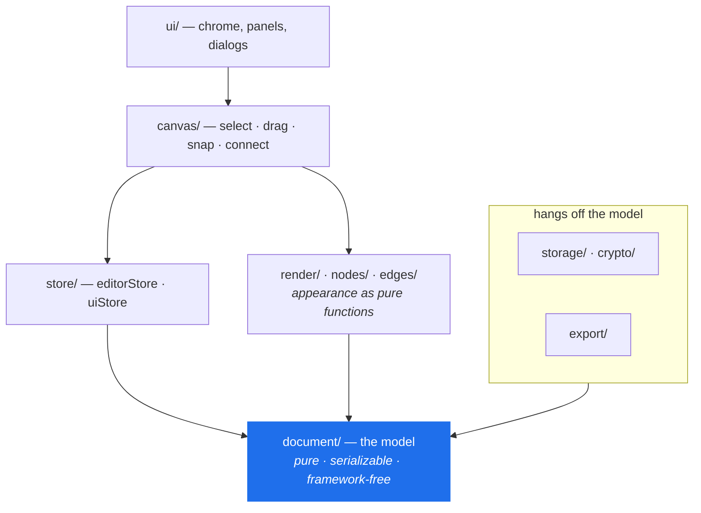
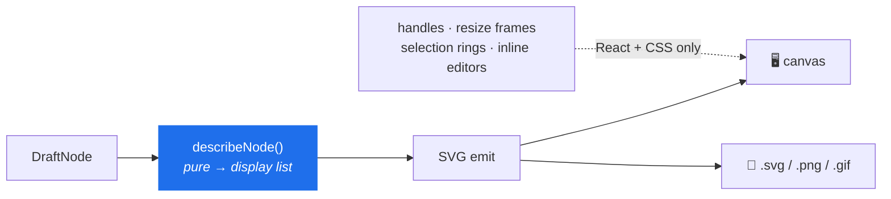
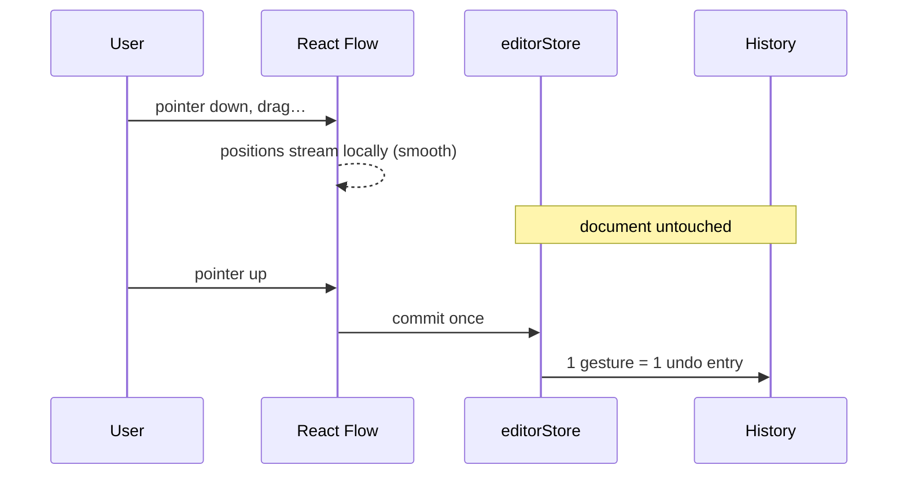
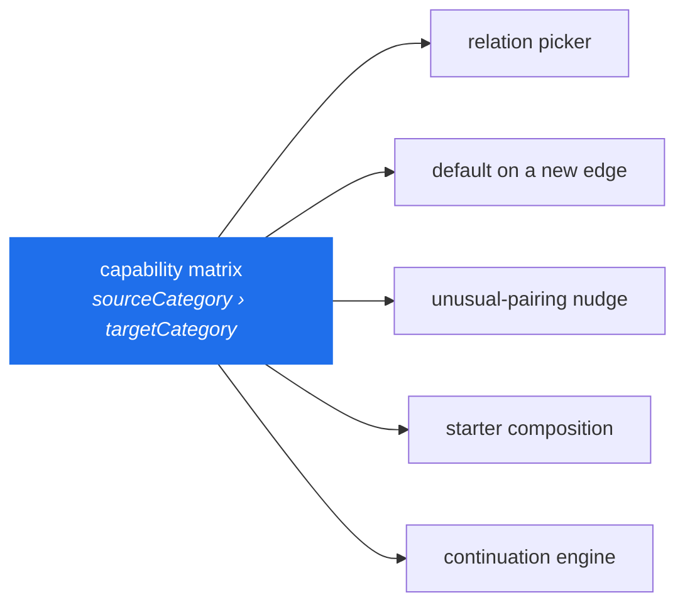
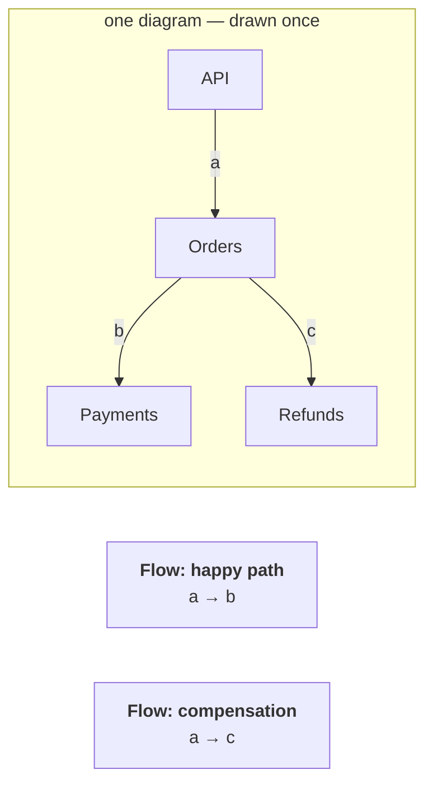
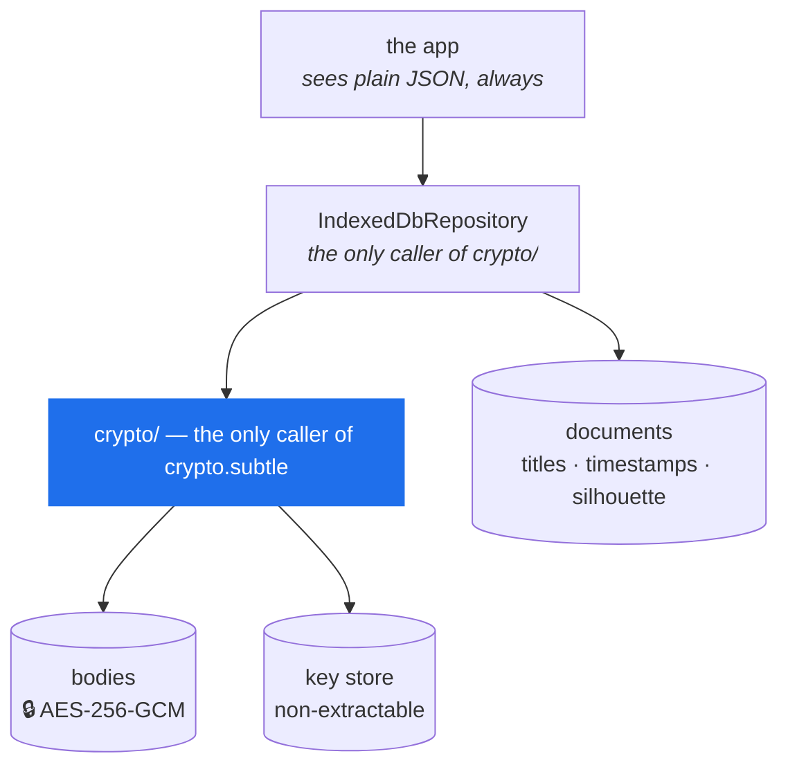
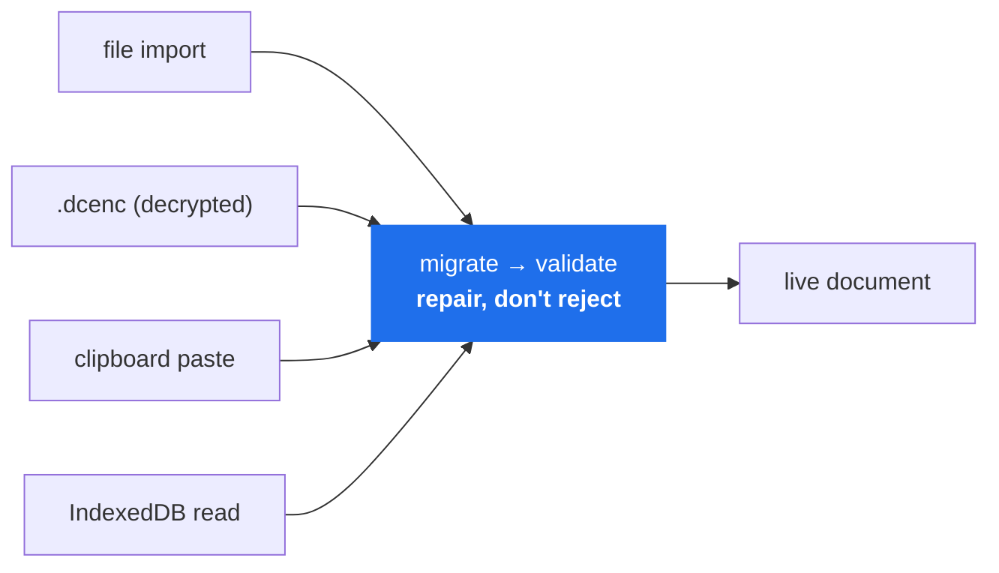

# Architecture

> **The one-sentence version:** a serializable document model with a pure renderer bolted to it —
> everything else is a view.

| Looking for | Go to |
| --- | --- |
| Why it's built this way | this document |
| What it understands about a diagram | [`SEMANTICS.md`](SEMANTICS.md) |
| The file format and migrations | [`SCHEMA.md`](SCHEMA.md) |
| "Never break this" | [`AGENTS.md`](../AGENTS.md) |
| Threat model and keys | [`SECURITY.md`](../SECURITY.md) |

---

## The problem

Someone is in a meeting that suddenly needs a diagram. A few minutes, no appetite for a login
screen, a rough architecture in their head.

```
speed          over   completeness
opinion        over   configurability
throwaway      but    exportable without disappointment
```

---

## Principles

| # | Principle | What it buys |
| --- | --- | --- |
| 1 | **The document is the product** | The code is one reader of it. A file drawn today outlives every framework decision above it. |
| 2 | **Local-first is enforced, not promised** | A test fails on any network primitive in `src/`; the CSP makes cross-origin requests impossible. |
| 3 | **One renderer** | Screen and export are the same drawing, not two that agree most of the time. |
| 4 | **Model meaning, not technology** | Component, Adapter, Queue — never Kafka, Spring, Lambda. |
| 5 | **Suggest, never block** | Rules narrow and propose. None forbids. |
| 6 | **Derived beats stored** | Nothing recomputable earns a migration, a validator and an undo entry. |
| 7 | **Deterministic, not clever** | Same document + selection → same answer. No model, no network, no adaptation. |
| 8 | **Degrade, never destroy** | Worst case is a smaller diagram, never a lost one. |
| 9 | **One surface per capability** | Palette, context menu and shortcut are three names for one store action. |

Two of these carry their own test before they're allowed to be called true:

- **#4's admission test** — *if every technology in this architecture were replaced, would the
  concept still make sense?* Component, Adapter, Datastore, Queue: yes. Kafka, PostgreSQL, Lambda:
  no. A technology name is a label a user types onto a primitive, never a reason to add one.
- **#2's build test** — `tests/privacy.test.ts` greps the app's own source for `fetch`,
  `XMLHttpRequest`, `WebSocket`, `sendBeacon`, `eval`. See [`PRIVACY.md`](PRIVACY.md).

---

## Shape of the system



**Every arrow points down toward `document/`, and `document/` points at nothing.** It imports
neither React nor React Flow. That single rule is what makes the file format survivable.

| Area | What lives there |
| --- | --- |
| `document/` | types · operations · flow · semantics · validate · migrate · limits |
| `render/` | text layout · code highlighting · SVG emit · PNG rasterize · theme |
| `nodes/`, `edges/` | appearance as pure functions; routing and bundling |
| `canvas/` | the React Flow surface, projection, snapping, spatial nav |
| `store/` | `editorStore` (the document) · `uiStore` (ephemeral UI) |
| `storage/`, `crypto/` | persistence, autosave, encryption at rest |
| `commands/` | one registry the palette, menu and shortcut sheet all read |
| `starters/` `continuation/` `sequence/` `presentation/` `learning/` | capabilities derived from the model |

Library and editor are two states of one screen (`src/App.tsx`, no router) — which is why the build
can be served from any path.

---

## One renderer

Principle #3, drawn:



Interactive chrome lives in React/CSS *specifically* so it can never leak into an exported image.
Text wraps in exactly one module; a second wrapper would agree most of the time, which is worse
than not agreeing at all.

> ⚠️ **Connectors are the exception.** On-screen and exported edges are two independent
> implementations. Nothing enforces parity — a new badge, dash or chip must be added in **both**.

---

## The canvas boundary



The store owns the document; React Flow is a *controlled view*, projected during render. The
document never carries half-finished state.

---

## Core concepts

### The document model

Plain data. Closed enums. No functions. Every mutation in `document/operations.ts` is a pure
function returning a new document that **reuses untouched nodes** — that structural sharing is what
makes snapshot history affordable and "what changed?" answerable by identity.

### Relationship model

One capability matrix, keyed by the categories of the two endpoints, is the single source of truth
for what a connection probably means.



Deliberately **sparse** — an undocumented pairing keeps full freedom. The matrix being *one* thing
is what makes the rest safe: a starter can't state a relationship the inspector would disagree
with, and a suggestion can't propose a pairing the app wouldn't have inferred itself. Rules:
[`SEMANTICS.md`](SEMANTICS.md).

### Flows and presentation

A flow **narrates connectors that already exist** — it orders *references*, never copies.



So two flows share early steps and diverge later, and one diagram carries both stories. Playback,
the lens, step badges, GIF export and sequence export are all readings of that same ordered list.

### History

Snapshot-based over the shared-structure model. A gesture brackets into one entry; entries in the
same continuous edit merge, so typing a name is one undo. Viewport changes persist but are never
recorded — moving the camera is not an edit.

### Persistence and the crypto boundary



The two-store split is what lets the library list itself without deserializing — or decrypting — a
single canvas. The fingerprint drawn as a library thumbnail is **silhouettes, never words**.

Failure posture: a failed decrypt never overwrites the only copy; no IndexedDB falls back to memory
and says so plainly.

### Untrusted input and schema evolution



One door, no second less-careful path. A diagram with three broken edges opens with the other
ninety-seven intact and reports what it dropped. Enums whitelisted, coordinates clamped, ids
de-duplicated, cycles detached — colour is an enum, so no user string ever reaches an SVG `fill`.

Version numbers are read in exactly one place. A newer file is refused *by name*; an older one
walks one function per transition. Contract: [`SCHEMA.md`](SCHEMA.md).

### Derived capabilities

Four features are best understood as **derivations of the model** — that framing is what keeps them
from becoming separate systems.

| Capability | Derives | The rule that keeps it honest |
| --- | --- | --- |
| **Starters** | opening compositions → ordinary nodes/edges/flows | Composition is authored; relationships come from the matrix; nothing sets appearance. No document records that a node came from one. |
| **Intent Continuation** | one node + its neighbourhood → the next move | Validity is the matrix. Ranking is declaration order. The preview *is* the result, materialized once. Silence is the default. |
| **Sequence export** | every playable flow → one Mermaid/PlantUML file | An export format, not a mode. Responsibility ends at correct, deterministic text. |
| **Commands** | selection + mode + document → what makes sense now | Re-derived, never registered. Each one calls an existing store action. |

### Keyboard model

One handler, one focus model, one source of truth for shortcut strings. The canvas is **a single
Tab stop**, not a few hundred — selection is the keyboard-focus indicator, a virtual-focus model
that scales. Shortcut strings live on the commands themselves, and a test cross-checks the shortcut
sheet against the registry in both directions.

---

## The two seams

Both are knowing departures from the principles above, and both bite silently:

| Seam | Failure mode |
| --- | --- |
| Two independent connector renderers | A visual added on-screen is missing from every export, and nobody notices for weeks. |
| Side effects inside a React state updater | Dev mode runs updaters twice — this once recorded every drag twice and made undo look broken. |

---

## Testing posture

Organized around guarantees, not modules: the model and its operations · round-tripping and
migration · hostile imports · undo granularity · storage failure modes · text layout and SVG
escaping · the privacy claim · performance at scale · and one browser run of the whole journey —
build, connect, undo, reload, export, delete, import, edit.

> **Anything this document calls a principle should have a test that fails when it stops being
> true.**

---

## Deliberately not built

```
accounts · cloud sync · collaboration · comments
AI generation · template galleries · cloud-provider icon packs
```

Each would be a reasonable product; none of them is this one.

Kept out of the way rather than designed for: Mermaid import, image nodes, PWA install.
