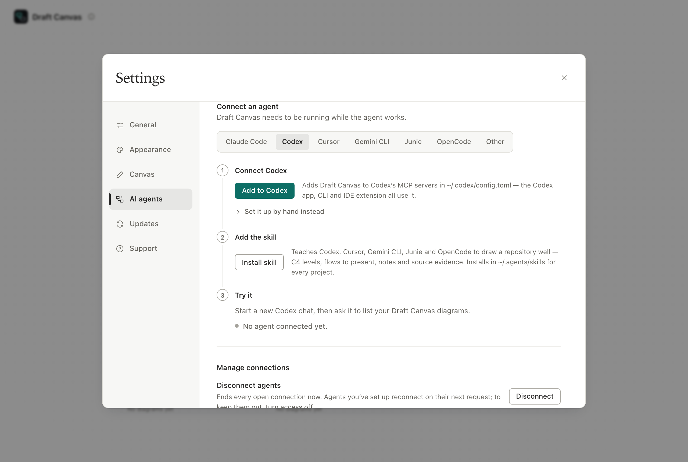
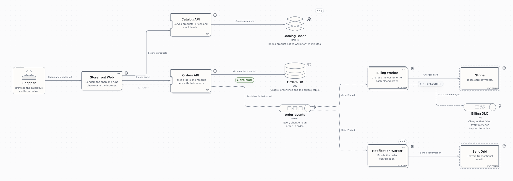

# Connect an AI agent

Let a coding agent such as Claude Code, Codex, Cursor, Gemini CLI, Junie or OpenCode draw and update
diagrams in Draft Canvas Desktop, on macOS or Windows.

Agents reach only the folders you allow. Your agent may send diagram content to its AI provider, as
it does with code. [Agent integration](../reference/agent-integration.md) describes the tools agents
use.

## Turn it on

1. Open **Connect an agent…** on Home, or **Settings → AI agents**. **Connect your agent**, at the
   top, says whether an agent is connected.
2. Turn on **Allow agent access**.
3. Under **Allowed folders**, tick the folders the agent may use. Subfolders are included. A folder
   is listed once you have opened it in Draft Canvas.
4. Under **Set up an agent**, choose your agent. An agent that is already set up has a tick.
5. **Connect** *agent*: click the agent's button (see the table).
6. **Add the skill** (optional): click **Install skill**. It teaches the agent to draw a repository.
7. **Try it**: start a new agent session and ask it to list your Draft Canvas diagrams. The step
   says **1 agent connected** once the agent gets through.



Once access is on, **Connect your agent** also offers the button for the first agent Draft Canvas
finds on your computer, so one click there does step 5.

| Agent | Button |
| --- | --- |
| Claude Code | **Add to Claude Code** (every project) |
| Codex | **Add to Codex** |
| Cursor | **Add to Cursor** (opens Cursor) |
| Gemini CLI | **Add to Gemini CLI**; start sessions in a trusted folder |
| Junie | **Add to Junie** |
| OpenCode | **Add to OpenCode** (every project), then restart OpenCode; see [OpenCode](#opencode) |
| Other MCP clients | Choose **Other** and copy the `mcpServers` entry into the client's configuration |

If Draft Canvas cannot find `claude` or `gemini`, Settings shows a terminal command to run instead.
To configure by hand, open **Set it up by hand instead** (Cursor: **Copy the config instead**).

Keep Draft Canvas running while the agent works. On macOS 14 or later, agents keep working while the
window is hidden (restart once if Settings asks). On macOS 12–13 and Windows, keep the window open.

The skill installs in `~/.claude/skills` (Claude Code) or `~/.agents/skills` (other agents) and
updates with Draft Canvas. A copy you have edited is left alone until you click **Replace skill**,
which backs it up first.

### OpenCode

**Add to OpenCode** adds a `draft-canvas` server to `~/.config/opencode/opencode.json` (on Windows,
`.config\opencode\opencode.json` in your user folder) and keeps the rest of the file. **Set up**
means the file is written; **Try it** says when OpenCode has connected. To check from OpenCode's
side, run this in your project folder. It should list `draft-canvas` as connected.

```bash
opencode mcp list
```

Draft Canvas leaves the file alone, and says why, when:

- It has comments or trailing commas, which Draft Canvas cannot keep. If only `opencode.jsonc` has
  them, `opencode.json` beside it is written instead; OpenCode reads both.
- Draft Canvas is set up more than once: in both files, or under both `mcp` and `mcp.servers`. Keep
  one, then click again.
- A server named `draft-canvas` is something else, such as a remote server. Rename or remove it.

To set it up by hand, or for one project only, paste the entry from **Set it up by hand instead**
into that file or the project's `opencode.json`. Access is still limited to **Allowed folders**.

## Draw a repository

Open your agent in the repository and ask:

> Use the Draft Canvas skill to map this repository’s runtime architecture. Verify boundaries
> and connections in source, cite evidence, and mark inferences. Add component views where
> they explain real logic, and presentation flows for verified requests and handled failures.
> Don’t turn dependencies or concurrent effects into an invented execution order. Inspect every
> view and fix readability before finishing; tell me the scope and any unresolved questions.

Draft Canvas shows the agent's source evidence but does not check it, so read the inferred parts and
open questions first.



Follow-ups change the same diagram:

- "Add a billing dead-letter queue and explain the retry policy in a note."
- "Refresh this diagram from the changed code; keep my notes and arrangement."
- "What happens if Payments goes down?" The agent reads the same [outage](outage.md#with-your-agent)
  the canvas shows.
- "What changed in this diagram since Monday?" The agent reads the diagram's
  [history](history.md#agents-and-history), but never restores or merges.

To limit a change, select shapes first and say so: "Add a retry path around this selection." The
agent changes only what was selected when it read the selection.

## Watch and undo

- Longer requests show progress above the status bar, with **Show** for a new diagram.
- **Cancel** works until the line says *Applying…*. After that, use Undo; each change is one undo
  step.
- A change saves automatically if you had no unsaved edits. Otherwise you save it.

## Review a proposal

To check changes before they are applied, ask for a proposal:

> Compare this pull request with the diagram. Propose the architectural changes without applying them.

1. Click **1 proposal to review** above the diagram.
2. Read the changes. **Focus changes** shows them on the canvas.
3. Click **Accept** to apply the whole proposal, or **Reject** or **Dismiss**.

To accept only part, ask the agent to revise it. If something the proposal is about has changed,
**Accept** stays disabled until the agent revises it.

## Stop an agent

In **Settings → AI agents**:

- **Disconnect agents** → **Disconnect** ends connections. Set-up agents reconnect on their next
  request.
- Untick a folder to remove access. A ticked parent folder still includes it.
- Turn off **Allow agent access** to stop everything. Folder choices are kept.

## Troubleshooting

| Problem | Fix |
| --- | --- |
| Draft Canvas not running or not responding | Open it, check access is on, and keep the window open where required. |
| Folder not allowed | Tick it under **Allowed folders**. |
| Layout refused | Ask for a smaller diagram, or put detail inside services. |
| Version mismatch, or Settings shows **Update** *agent* | Click it to point the agent at this copy of Draft Canvas. |
| Claude Code finds Draft Canvas in one folder only | Use **Add to Claude Code**, which sets it up for every project. |
| OpenCode is **Set up**, but `opencode mcp list` doesn't show `draft-canvas` as connected | Restart OpenCode. If that doesn't help, something overrides the global file: a `draft-canvas` entry in the project's `opencode.json` or `.opencode/` folder, or `OPENCODE_CONFIG`, `OPENCODE_CONFIG_DIR`, `OPENCODE_CONFIG_CONTENT` or `XDG_CONFIG_HOME` set in your shell. `opencode debug config` shows what OpenCode loaded; paste the entry where it reads it. |
| **Add to OpenCode** says the file has comments, or that Draft Canvas is set up more than once | See [OpenCode](#opencode). |
