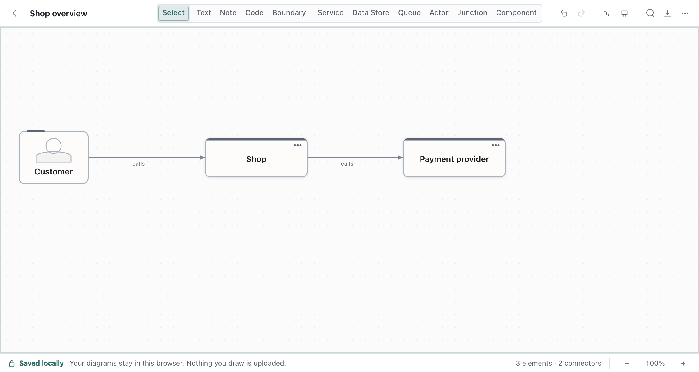
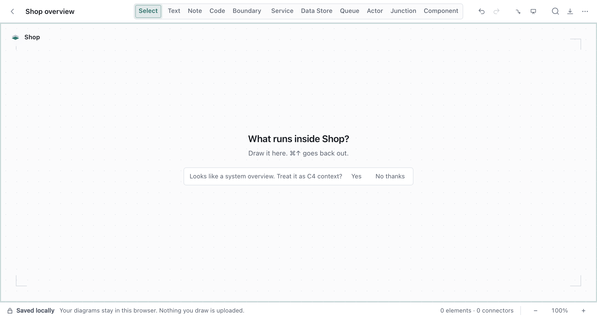
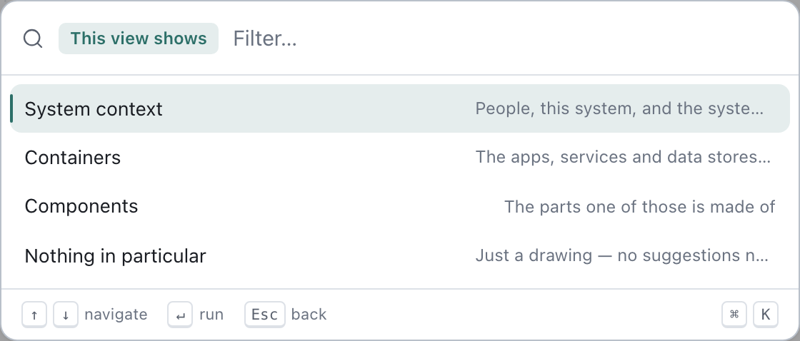
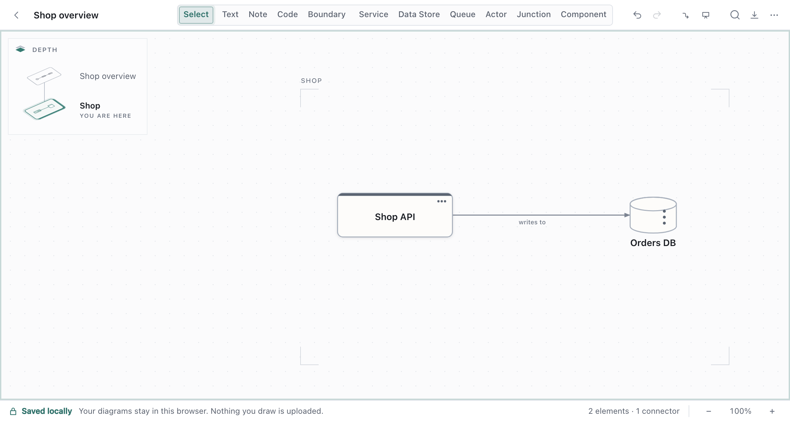

# Explain a system at different levels

A diagram that shows everything explains nothing. The usual fix is to draw the big picture first
and the detail separately, the way the C4 model does: a system in its surroundings, the containers
it runs on, the components inside one of them.

Draft Canvas builds that into one canvas. Any Service or Component can have a **room** inside it, a
canvas of its own for what runs there. You keep the overview small and step into a shape when
someone asks "and how does *that* work?".

Shortcuts are written for a Mac. On Windows and Linux, read `⌘` as `Ctrl`.

## Draw the overview

Start at the top with the shapes that matter to your audience: the people who use the system (Actors),
the system itself (a Service), and the systems around it. Something like a Customer, `Shop`, a
payment provider and an email service.

Keep it to what someone needs to see in one glance. You don't need to fill in the inside yet.

## Look inside a shape

Select `Shop` and press `⌘↓`. The canvas changes to a room that belongs to that shape, and it starts
empty. Draw what runs there: an API, a database, a queue and a worker.

- Choose **Look inside** from the palette (`⌘K`) or the shape's right-click menu to do the same.
- Press `⌘↑` to go back out. `Esc` does too, when nothing is selected. The shape you came from stays
  selected, so `⌘↓` takes you straight back in.
- Do it again inside a container: select the API and press `⌘↓` to draw its components.

An empty room writes nothing to your file. A room only exists once you've drawn a shape in it, and
if you delete the last shape it goes away again. You never have to create or delete a view.

## Tell the canvas what level it's showing

You can say what a view is for, and Draft Canvas will use it to narrow its suggestions. Open the
palette, run **View level…**, and choose:

| Choice | Meaning |
| --- | --- |
| **System context** | People, this system, and the systems around it |
| **Containers** | The apps, services and data stores it runs on |
| **Components** | The parts one of those is made of |
| **Nothing in particular** | Just a drawing; no suggestions narrowed |

You mostly only need to set the top one. A room inside a System context canvas is treated as
Containers, and a room inside Containers as Components. A room's own choice always wins.

If a canvas looks like a system overview (people, one or more of your own services, and something
external) and you enter an empty room from it, Draft Canvas asks once whether to treat it as C4
context. **Yes** sets it; **No thanks** drops the question for the session.

The level only steers suggestions, such as which shape to offer next. It never refuses a shape or a
connection, and a diagram that ignores C4 works fine.

## Find your way around

The **Depth** control in the top left corner of the canvas appears once any shape has something
inside it (inside a room it is always there). Hover it, focus it, or click to hold it open. It shows:

- **The way back out**, a column of planes above you. Click one to go up to it.
- **Where you are**, labelled *You are here*, with the rooms beside you in the same parent.
- **The rooms below**, one plate per shape here that has an inside. Click one to step in.

Hovering a plate lights up the shape it belongs to. When the current level is known, the status bar
also shows it, and clicking that chip opens **View level…**.

## Present and export at a level

- **Presenting.** `⌘↓` and `⌘↑` keep working while you present, so you can step into a system
  mid-walkthrough and come back out.
- **Exporting.** Inside a room, the Image and Source exports ask **What to export**: the
  room you're in, or the whole canvas. A `.draftcanvas` export always contains everything.

## What to know

- **Only a Service or a Component (other than a Port) can have a room.** Actors, data stores, queues
  and the rest can't; on those, `⌘↓` says so.
- **Rooms go three deep** below the top canvas, four levels in all. Beyond that, Draft Canvas says
  *That is as deep as a canvas goes.* If you find yourself wanting more, the detail probably belongs in a
  separate diagram.
- **It's all one file.** Rooms are saved inside the shape that owns them in the same `.draftcanvas`
  document, so one file holds the whole picture. Copying or deleting a shape takes
  its room with it. Limits such as the total number of shapes count across every room.
- **It's C4-aware, not a C4 tool.** Levels are labels that steer suggestions. They don't add shape
  types, enforce C4 rules, or generate separate diagrams.

The design reasoning is in [Architecture](../reference/architecture.md), and the file format in the
[schema reference](../reference/schema.md).
