# Architecture examples

A starter fills a blank canvas with a composed, editable architecture: real shapes and connectors,
each connector's meaning derived from the same rules as anything you draw by hand, usually with a
flow or two already defined. Nothing marks the result as "from a starter"; it is your diagram from
the first edit.

Five are offered wherever you start a diagram (the home screen, a blank canvas, the desktop app's
Home): **Monolith**, **Microservices**, **Event-Driven**, **Hexagonal** and **CQRS**. They were chosen
for how much they teach and how easily each is adapted, one of each shape a first diagram tends to
take, and the set is deliberately small.

The rest of the catalog is reachable by name: open a canvas, press `⌘K` (`Ctrl+K` on Windows and
Linux), type part of the name, and press `Enter`. An AI agent connected to the desktop app can start
from any of them too (`create_diagram` with `starter`, see [Agent integration](../reference/agent-integration.md)).

| Starter | Group | What it draws |
| --- | --- | --- |
| Monolith | Architectures | One application, built and deployed as a unit: API, business logic and data access layers over one store |
| Modular Monolith | Architectures | One deployable, explicitly encapsulated modules inside |
| Microservices | Architectures | Independently deployed services, each owning its data, behind a gateway |
| Event-Driven | Architectures | Pub/sub: a topic fanning out to per-subscriber queues, workers and one dead-letter queue |
| Hexagonal | Architectures | Adapters around a core that owns its ports |
| Backend for Frontend | Architectures | A backend per frontend, over shared capabilities |
| CQRS | Architectures | Distinct command and query paths, with an asynchronous read projection |
| Medallion | Data Architectures | Refine raw data into validated, business-ready datasets |
| Kappa | Data Architectures | Process live and historical data through one durable stream |
| Change Data Capture | Data Architectures | Capture committed changes once, fan out to derived views |
| Saga – Orchestration | Patterns | Local transactions and compensation, one coordinator |
| Saga – Choreography | Patterns | Local transactions chained by events, with no coordinator |
| Transactional Outbox | Patterns | Persist state and event intent atomically, publish after |

The catalog is frozen: these are examples to adapt, not a template library, and a starter is only
ever a starting point. Every one lands on the canvas you are on and never replaces what is there.
The shapes it creates are ordinary shapes; delete, rename and rewire them as you would anything else,
and the connectors keep labelling themselves as you do.

## What each one draws

Every picture below is the starter exactly as it lands, framed with **Fit to view** (`⌘K`, then
`Fit to view`); the pictures are regenerated from the app with `npx tsx e2e/docs-screenshots.ts`.

### Monolith

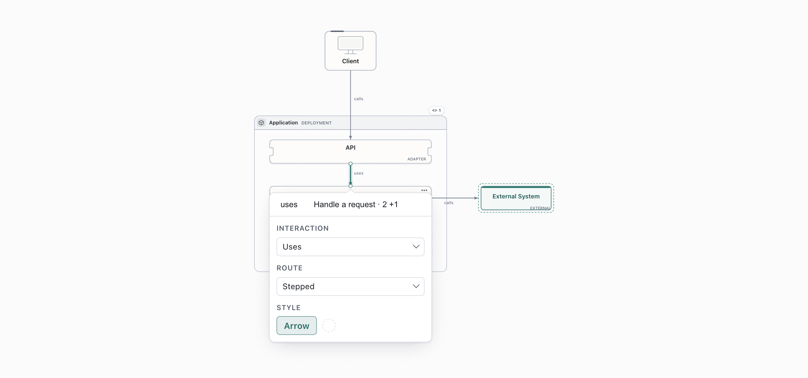

### Modular Monolith

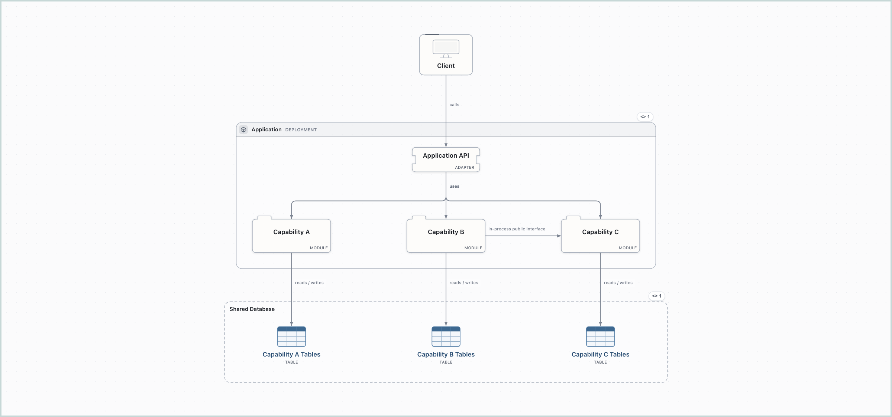

### Microservices

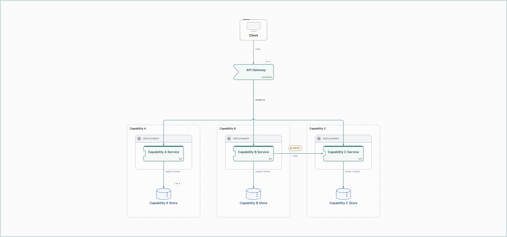

### Event-Driven

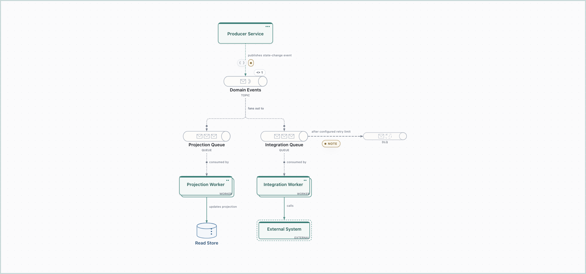

### Hexagonal

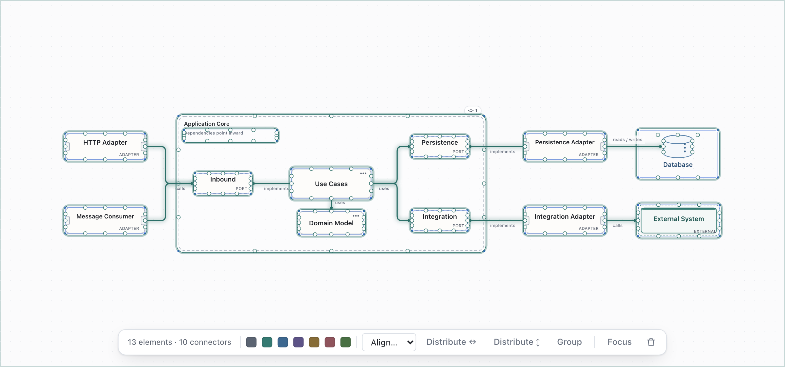

### Backend for Frontend

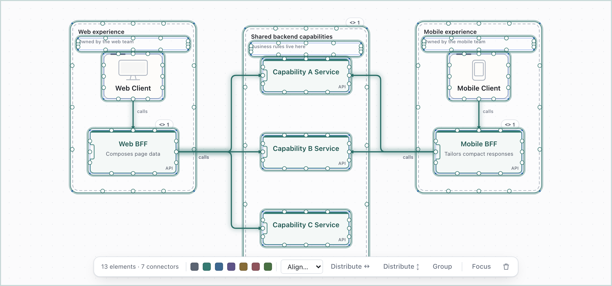

### CQRS

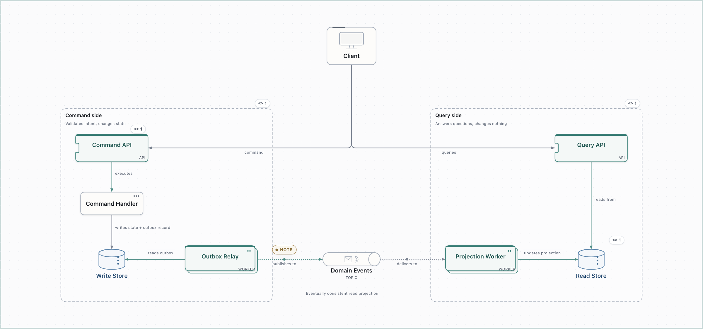

### Medallion

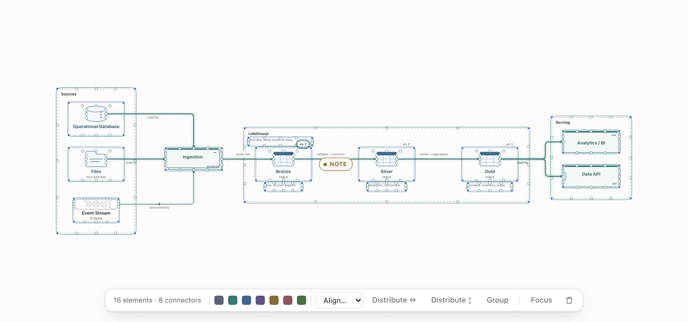

### Kappa

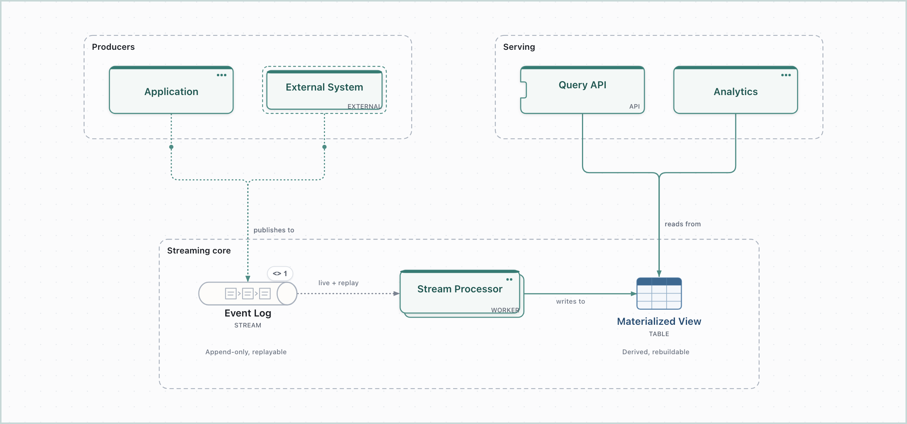

### Change Data Capture

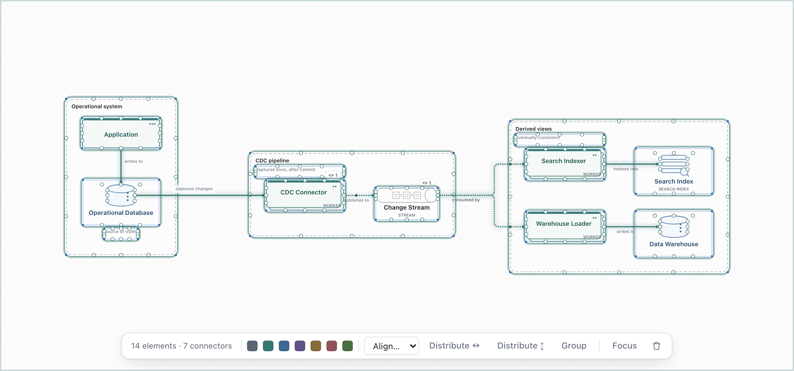

### Saga – Orchestration

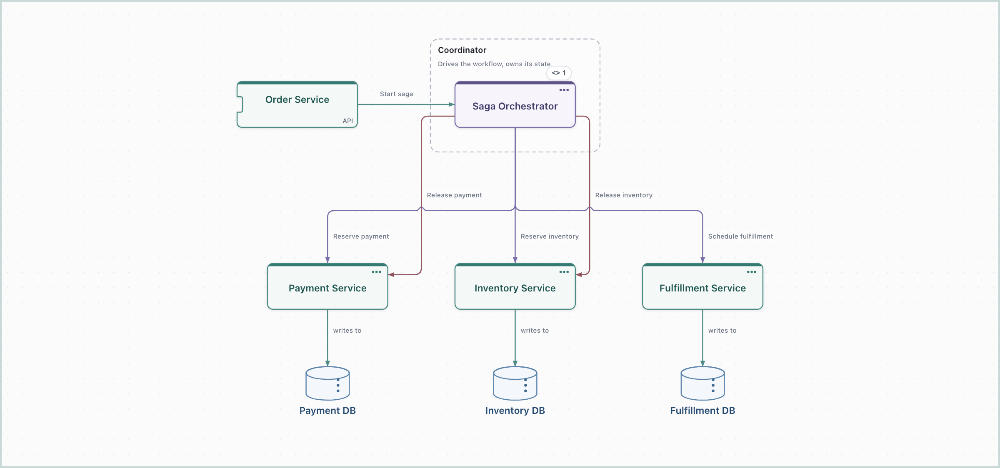

### Saga – Choreography

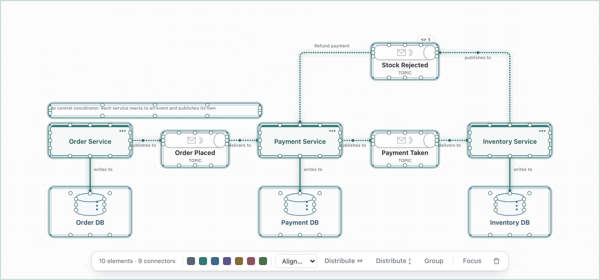

### Transactional Outbox

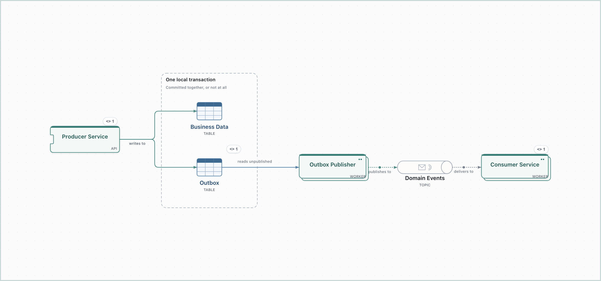

See also [Shapes, connectors and boundaries](shapes-and-connectors.md) for what the shapes mean, and
[Architecture semantics](../reference/semantics.md) for the rules every connector follows.
