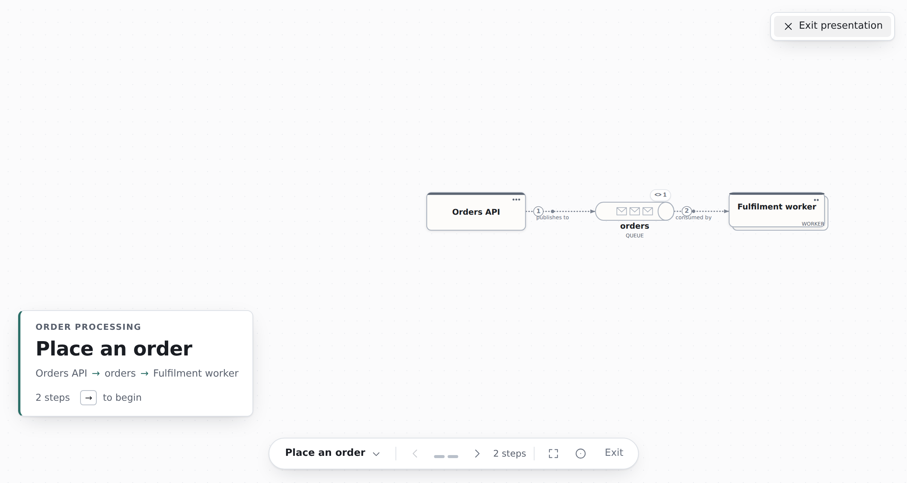

# Getting started

In a few minutes you'll draw a small system, annotate it, walk someone through it, and export
it. The system is an API that puts orders on a queue for a worker to process.

You need the app open: the [hosted version](https://acltabontabon.com/draft-canvas/editor/), a
[Docker copy](../../README.md#running-it-yourself), or the
[VS Code extension](vscode.md). Nothing here needs an account, and nothing you draw leaves your
browser.

Shortcuts are written for a Mac. On Windows and Linux, read `⌘` as `Ctrl`.

## Start a canvas

On the first visit, choose **New canvas** (pressing `Enter` also works). Later, the same **New
canvas** button is at the top of the Library, the list of your saved diagrams. Your diagram
saves itself as you work; see [Saving, backing up and sharing](saving-and-sharing.md).

## Draw Service → Queue → Worker

1. **Add the service.** Move your pointer over the canvas and press `S`. A Service appears under it,
   ready to type. Type `Orders API` and press `Enter`.
2. **Add the queue.** Select the service and drag from one of the small dots on its edge (its handles) into empty
   space, then let go. A short menu offers Service, Data Store, Queue and Actor. Choose **Queue**,
   press `Enter` to name it, and type `orders`.

   

3. **Take the suggestion.** With the queue selected, a faint Worker appears beside it, connected. That
   is Draft Canvas guessing your next move from what you've drawn. Press `Tab` to accept it, then
   `Enter` to name it `Fulfilment worker`. If the guess isn't what you want, press `Esc`, or `]` to
   see another.

   

The connectors have labelled themselves with what they mean. The line from the API to the queue
says it *publishes to* it, and reads in the direction the arrow points. To change one, select the
connector and pick another relationship from its popover; only those that make sense for that pair
are offered. Nothing stops you drawing something unusual on purpose.

Pointing at a connector highlights it faintly and marks its two ends, so you can see which one a click
will select; click anywhere along its line, or on its arrowhead. When several connectors leave a shape
along the same line with the same label, the label is shown once on the stretch they share. Click it to
select one of them, and click again for the next.

Some other ways to draw the same thing:

- Press `⌘K`, type `queue`, and press `Enter` to add a Queue from the palette.
- Type a letter for other shapes: `D` Data Store, `A` Actor, `B` Boundary, `N` Note. `?` lists them all.
- Select a shape, press `⌘K`, and choose **Connect to…** to wire it to another shape without the mouse.

## Add a note

Notes are for what the boxes don't say: why the queue is there, or a decision the room just made.

1. Press `N` to drop a note and type into it. `Enter` starts a new line; `Esc` keeps what you typed.
2. Drag the note onto the queue and hold it there until it docks. It collapses to a small chip on the
   shape, and clicking the chip opens the note. You can dock a note on a connector the same way.

Or right-click a shape and choose **Add Note**, which creates one already attached.

## Draw a boundary

A boundary is a frame around shapes that belong to the same scope. Select some shapes and press `⌘G`
to put a boundary around them, or press `B` to draw an empty one. A shape dragged into a boundary
becomes part of it. When you move, copy or delete a boundary, the shapes inside go with it.
Draft Canvas never moves a shape into or out of a boundary just because the two overlap.

Choose a boundary's **kind** in the bar that appears when you select it. Each kind has its own
outline and header, so you can tell kinds apart without reading the labels:

| Kind | Use it for | How it looks |
|---|---|---|
| Boundary | Any frame, with no particular meaning | Dashed outline, name only |
| Group | Shapes that go together for this explanation | Dotted outline, quiet name |
| System | What sits inside one software system | Solid outline, window mark |
| Domain | Shapes that share a domain responsibility | Dashed outline, name on a corner tab |
| Network | What sits within one network scope | Dash-dot outline, connected-nodes mark |
| Deployment | What runs in one runtime or hosting scope | Solid outline, cube mark, ruled header |

These kinds describe your diagram. They don't enforce anything: a Network boundary doesn't make
anything secure, and a Deployment boundary doesn't have to be one machine.

The name is the boundary's own. The kind appears after it in small capitals, and is hidden when the
name needs the room. To rename a boundary, double-click its name or press `Enter`.

Use the colour swatch in the same bar to colour a boundary. The colour applies to the outline and
the kind mark, and tints the inside slightly, so the shapes inside stay easy to read. If you change
the kind later, the name, colour, contents and connectors stay as they were.

## Present a flow

A flow is a numbered path through connectors. It's how you say "first this happens, then this".

1. Click the connector from `Orders API` to `orders`. Its popover opens, with an **Add to flow** tab at
   the top. Click it. That starts a new flow with this connector as step 1 and opens the Flows panel
   with the name selected, so type `Place an order` and press `Enter`.

   

2. Click the next connector, from the queue to the worker, and choose **Add to Place an order** in the
   same place. It becomes step 2.
3. The **Flows** panel (the **Flows** button in the toolbar, or `F`) lists the steps. Use it to reorder,
   rename, or remove them.

   

4. Click **Present** in the toolbar. The editor gets out of the way and the flow opens: its title
   beside the whole path, framed with the rest of the diagram quietly around it. Press `→` or
   `Space` to begin. Each press tells one step: a signal travels the connector from where the
   interaction starts to where it arrives, the destination lights up, and a caption in the corner
   names the two shapes and what the step says. Then everything is still, so you can talk. `←` goes
   back, and after the last step the flow closes on its whole path, with **Replay** and the next
   flow a click away. `Esc` returns to editing, to the same view and the same selection you left.
   `⌘Enter` does the same as the button.

   

While a step is showing, the notes attached to what it shows appear beside it. The note on the queue
appears when the flow first reaches the queue.

The camera follows the story rather than each shape: it holds still while the next step already
reads, slides a little when it has to, and only recomposes for a long handoff. Pan or zoom by hand
whenever you like; **Re-centre** (`R`) hands the camera back. **Overview** (`O`) pulls back to the
whole flow without losing your place, and the pointer (`P`) is a soft ring that follows your cursor
for pointing at things.

If you have more than one flow, Draft Canvas asks **Present which flow?** first — and you can change
your mind later without stopping. The bar names the flow you are in and where it sits (`Place an
order · Flow 2 of 4`); click it for the full list, or press `Shift+→` and `Shift+←` to move to the
next and previous flow. On the last step of a flow, the button to the right of the title names the
one that follows, so the hand-off is there when you need it.

## Export it

Press `⌘⇧E`, or open **Export** in the toolbar.

- **Image → PNG** for a slide or a chat message. Choose the **Light** palette for a document, or tick
  **Transparent** to lay it over your own background.
- **Document → Editable** saves a `.draftcanvas` file you can reopen later, send to someone, or commit
  to a repository.
- **Source** turns your flow into a Mermaid or PlantUML sequence diagram, as plain text you can paste
  into a README or wiki.

The [saving guide](saving-and-sharing.md#export-a-file) covers each option, including encrypted
exports.

## Where next

- **Skip the blank page.** Press `⌘K` and type `microservices`, `cqrs` or `saga`: a starter fills the
  canvas with a composed architecture you edit like anything else.
- **Show more or less detail.** [Explain a system at different levels](depth.md) uses **Look inside**
  to keep the overview clean and draw the detail one level down.
- **Go faster.** [Keyboard shortcuts and the command palette](keyboard-and-commands.md).
- **Say what is still open.** [Mark what is still open](open-points.md) attaches a tentative, awaiting-input
  or parked point to a shape or connector, for the next conversation to pick up.
