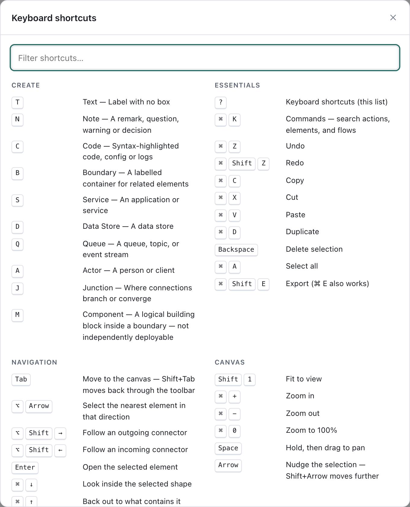
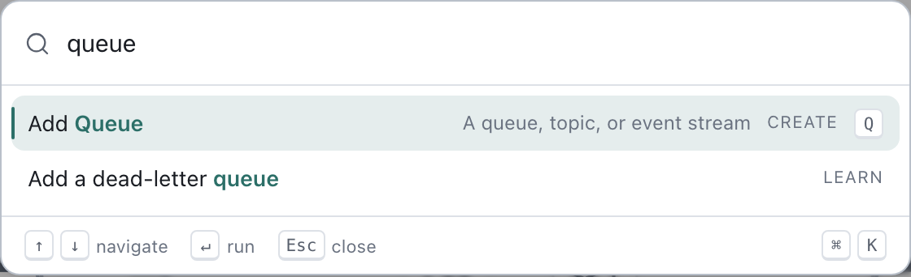

# Keyboard shortcuts and the command palette

Draft Canvas is built so you can draw without leaving the keyboard: a letter drops a shape, the
palette does the rest. This guide covers the moves worth learning first. For the complete list,
press `?` in the editor.

Shortcuts are written for a Mac. On Windows and Linux, read `⌘` as `Ctrl` and `⌥` as `Alt`.
Single-letter shortcuts only work when the canvas has focus, not while you're typing in a field or
when a dialog is open.

## The two things to remember

- **`?`** opens the shortcut sheet, with a filter box. It is built from the same list the app
  uses, and tests check the two agree.

  

- **`⌘K`** opens the command palette. Type part of a name and press `Enter`. Everything you can do
  from a menu is in there.

  

## Draw without the mouse

Press a letter and the shape appears under your pointer, ready to type its name. If the pointer
hasn't moved over the canvas, it appears next to the selected shape, or in the middle of the view.

| Key | Adds | | Key | Adds |
| --- | --- | --- | --- | --- |
| `S` | Service | | `N` | Note |
| `D` | Data Store | | `C` | Code |
| `Q` | Queue | | `T` | Text |
| `A` | Actor | | `B` | Boundary |
| `M` | Component | | `J` | Junction |

To connect two shapes, drag from one shape's handle onto another. Dropping on empty canvas opens a
short menu of shapes to create and wire up in one move. A shape made that way is selected but not yet
being named, so press `Enter` to type its name. Prefer the keyboard? Select a shape, press
`⌘K`, choose **Connect to…**, then pick an existing shape or a new one.

### Take the suggestion

When you select a shape, Draft Canvas sometimes shows a faint ghost of the likeliest next shape and
connector, for instance a Worker after a Queue. It only suggests when the diagram gives it a
reason, and it stays quiet otherwise.

| Key | Does |
| --- | --- |
| `Tab` | Accept the ghost |
| `]` / `[` | Show the next or previous alternative, or ask for one when nothing is showing |
| `Esc` | Dismiss it |

Some shapes have no suggestion on purpose. A Table could be an outbox, a read model or plain
business data, and nothing in the diagram says which. Pressing `]` on one opens the add-element menu
beside it instead, with a line saying why. Pick a shape with the arrow keys and `Enter` to add it and
connect it in one move.

Suggestions are on by default. **Turn off Intent Continuation** in the palette switches them off, and
the same command turns them back on.

## Move around

| Keys | Does |
| --- | --- |
| `⌥` + arrow | Select the nearest shape in that direction |
| `⌥⇧→` / `⌥⇧←` | Follow an outgoing or incoming connector from the selected shape |
| Arrow keys | Nudge the selection 1 unit; with `Shift`, 10 |
| `⇧1` | Fit the whole diagram in view |
| `⌘+` / `⌘−` / `⌘0` | Zoom in, zoom out, zoom to 100% |
| `Space` + drag | Pan (the mouse wheel and trackpad scroll pan too) |
| `⌘↓` / `⌘↑` | Look inside a shape, and back out. See [Explain a system at different levels](depth.md). |

To find something by name, press `⌘K` and start typing: named shapes, flows and labelled connectors
all appear as **Jump to** results. Choosing one selects it and moves the view to it.

## Edit

| Keys | Does |
| --- | --- |
| `Enter` | Edit the selected shape's or connector's text (a Boundary's caption too) |
| `Esc` | Step back one level: editing, then popovers, then the selection |
| `⌘Z` / `⌘⇧Z` | Undo / redo |
| `⌘C` `⌘X` `⌘V` | Copy, cut, paste. Pasting works between diagrams |
| `⌘D` | Duplicate |
| `Delete` or `Backspace` | Delete the selection |
| `⌘A` | Select all shapes |
| `⌘G` / `⌘⇧G` | Group into a Boundary / ungroup |
| `⌘B` / `⌘I` | Bold / italic, for a selected Text shape |

While you type, `Enter` commits a shape's label and `Shift+Enter` adds a line. Notes work the other
way round: `Enter` adds a line and `⌘Enter` commits. In a Code shape, `Enter` is always a new line.
`Esc` keeps what you typed in a Note and discards it elsewhere. On a Boundary, `Enter` edits its
caption.

`Shift+F10` (or the Menu key) opens the context menu for the selection, the keyboard route to the
same actions as a right-click.

## What the command palette does

Open it with `⌘K`, or from **Commands** in the toolbar. With nothing typed, it shows the commands
you used lately, then what applies to the current selection, then everything else, grouped:

- **Selection** and **Connector**: the actions for whatever you have selected, such as **Connect
  to…**, **Look inside**, **Make asynchronous**, **Reverse direction** or **Add to flow…**.
- **Create**: **Add Service**, **Add Queue** and the rest, each showing its letter.
- **Architectures**, **Data Architectures** and **Patterns**: starters that fill a blank canvas
  with a composed, editable architecture (Monolith, Microservices, CQRS, Saga, Outbox and others).
- **Flows** and **Takeaways**: start a presentation, add a flow, capture an action.
- **View** and **Canvas**: fit and zoom, **View level…**, **Tidy connectors**, **Export…**,
  **Canvas settings…**, **Keyboard shortcuts**, and **Open Learn Draft Canvas**.

Typing narrows the list with a forgiving match: `svc` finds **Add Service**. A few commands ask a
follow-up question in a second list, such as **Connect to…** or **View level…**; `Esc` steps back.
If nothing matches, the palette offers **Ask Learn about "…"**, which opens the in-app handbook.

The palette only names things the app already does. Anything you can pick in it, you can also do
with a shortcut or the mouse, and it is a good way to discover what exists.

## While presenting

`⌘Enter`, the **Present** button in the toolbar, and **Start presentation** in the palette all do the
same thing: open the flow — its title beside its whole path — and wait for you to begin. Press
`⌘Enter` again to leave.

Presenting is read-only. `→` or `Space` moves forward: it begins the story from the opening, goes to
the next step, and past the last step closes on the whole path, then on to the next flow. `←` goes
back the same way, to the opening from step 1. `Home` and `End` jump to the first and last step, and
a digit `1`–`9` jumps straight to that step; the marks on the control strip do the same with a
click. `Esc` leaves. `⌘K` still works, and shows only presentation commands. `I` still opens the
line for capturing an action.

The camera is directed: it holds still while the next step already reads, slides a little when it
has to, and cuts to a new composition only for a long handoff. `O` is **Overview** — the whole flow,
keeping your step; `O` again returns. Panning or zooming by hand stops the camera following the
story; `R` (**Re-centre**) hands it back. `P` toggles the pointer, a soft ring that follows the
cursor. The control strip recedes while nothing moves and comes back on any movement or key.

With more than one flow, you can move between them without leaving the presentation — which is what
makes it possible to follow a question from the room and carry on. `Shift+→` starts the next flow,
`Shift+←` the previous one, and `Shift+F` opens the list so you can jump straight to any of them.
The bar's title (`Payment processing · Flow 2 of 4`) opens the same list with a click. Flows run in
the order the Flows panel lists them and never loop back round: at the last step of the last flow
the bar simply says **End**.

Only a flow with at least one step can be presented, so the count is over the flows you can actually
reach — a document with five flows, two of them still empty, presents three.

Leaving puts the editor back where you left it: the same view, and the same shape selected. See
[Getting started](getting-started.md#present-a-flow).

## Learn the rest in the app

**Learn Draft Canvas** (in the toolbar's More menu, or from the palette) is a handbook of short
recipes, each a small animated scene using the real shortcuts. Use it for "how do I…" and come back
here for the overview.
