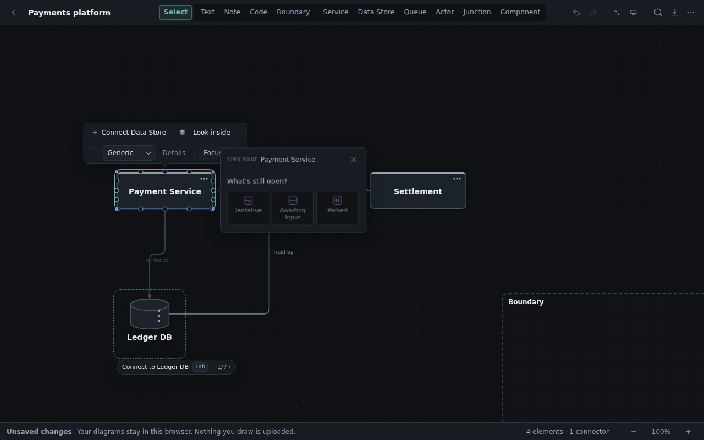
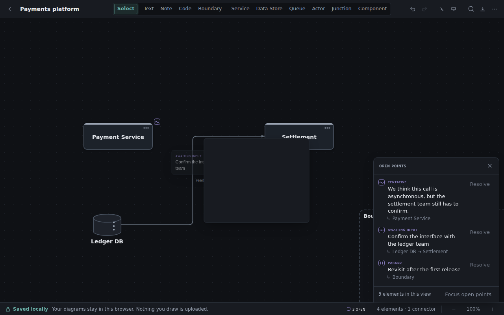

# Mark what is still open

A diagram tends to look more decided than the conversation that produced it. A box or an arrow can
stand for a working assumption, a rough first approach, something a colleague still has to agree to,
or an idea put off on purpose. **Open points** let you say so on the drawing itself, in a couple of
clicks, attached to exactly the shape or connector it concerns, without the architecture becoming
harder to read.

An open point is a note in the margin, not a shape: it never moves a connector, resizes a box or
changes what a relationship means. And the absence of one means only that nothing was noted. It
never means "verified", "approved" or "built".

## The three kinds

| Kind | Meaning | Context you might add |
| --- | --- | --- |
| **Tentative** | A working assumption or approach that has not been settled. | "This may need to be asynchronous." |
| **Awaiting input** | A specific answer, review or agreement is still needed from someone. | "Confirm the interface with the owning team." |
| **Parked** | The topic has deliberately been put off. | "Revisit after the first release." |

These are descriptions, not stages. A parked topic can be perfectly well understood, and waiting on
someone says nothing about how sure anybody is. Rough estimates and constraints belong in the
context text: "Rough estimate: a few days; depends on the interface decision."

## Raise one during the meeting

1. Select a shape, a connector or a boundary. Several elements selected at once make one shared
   point about all of them.
2. Press `I`, or right-click and choose **Add open point…** (also in the command palette, `⌘K`,
   and from the keyboard with `Shift+F10`).
3. Click **Tentative**, **Awaiting input** or **Parked**. The marker is on the element straight away.
4. Optionally type a sentence of context. **Enter** commits and closes; **Shift+Enter** starts a new
   line; **Escape** closes and puts focus back on the marker.

The marker is a small violet tab off the shape's top-right shoulder, or inside a boundary's corner,
or beside a connector's label. Each kind has its own glyph, a wave, an ellipsis and a pause mark, so
the meaning never rests on colour alone. Several points on one element fold into one tab carrying
their count.

Hover a marker, or focus it from the keyboard once its element is selected, for a preview of the kind
and the context. Click it to open the point: change the kind, edit the context, **Resolve** it, or
delete it. A point shared with other elements says so, and **Not this one** detaches just this element.

## Come back to it

The status bar shows how many points are still open. Click it for the **Open points** list: each
point, what it says, and the elements it is about, wherever in the file they live. A row takes you to
the element and opens its point; **Focus open points** dims everything that carries no marker,
without moving or changing anything, and **Exit focus** (or Escape) brings the rest back.

**Resolve** says the discussion moved on. The marker goes and the count drops; the shape, the
connector and the rest of the drawing are untouched. You can add a short note about how it was
settled, but you don't have to. Resolved points stay in a collapsed section of the list, where they
can be reopened or deleted. Nothing resolves on its own because time passed.

## Presenting and exporting

While presenting, the markers stay on the diagram, and clicking one shows the point read-only, so you
can say "this part is still open" without an editing surface appearing over the story.

Image exports (PNG and SVG) keep the markers by default and add a small key naming the kinds that
appear, since a picture has no hover. Untick **Open point markers** in the Export dialog for an image
without them. The `.draftcanvas` file always carries every point, resolved ones included. Mermaid and
PlantUML sequence diagrams have no way to express them and leave them out.

## Good to know

- Deleting an element removes the point attached to it. A point shared with other elements stays on
  those; undo brings both the element and its point back.
- Copying or duplicating a marked element gives the copy its own point, about the copy.
- A point on a boundary is about the boundary as a whole. It does not mark the shapes inside it.
- An AI agent connected to the desktop app can read the points and, when asked, raise, change or
  resolve them through the same review flow as any other change. Accepting a proposal never resolves
  a point on its own.
