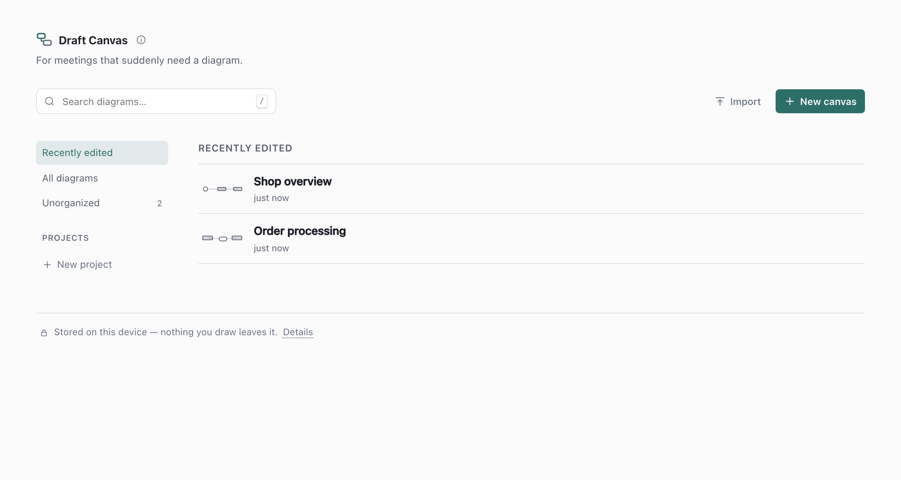
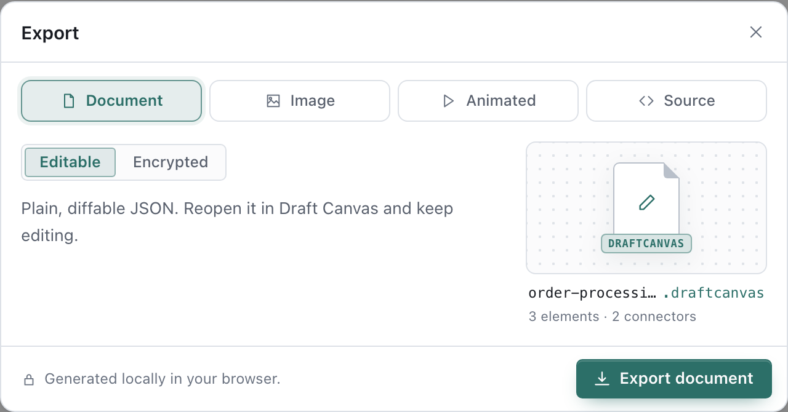

# Saving, backing up and sharing

Draft Canvas saves your work in your browser as you draw. It does not save it anywhere else. This
guide separates what happens on its own from what you have to do, because the second list is what
protects you from losing a diagram.

*In VS Code?* The file is the storage there, and none of this applies. See
[Working with `.draftcanvas` files in VS Code](vscode.md).

## What happens on its own

- **Autosave.** About 0.7 seconds after you stop editing, the diagram is written to this browser's
  local database (IndexedDB). If you never pause, it still writes at least every 4 seconds. The
  status bar says **Saved locally** when it has. You will only see **Saving…** if a write is slow.
- **Where you left off.** Moving the canvas is saved too, so a diagram reopens where you left it.
- **Leaving.** Closing the tab, reloading, or switching away flushes a final save. That is
  best-effort: a browser can end a page before storage finishes, so don't rely on it for work you
  can't redraw. Going **Back to your diagrams** waits for the save and tells you if it failed.
- **Plain records.** Diagrams are stored as plain records in the browser's own database, readable by
  anything that can read this browser profile — the same as a file in your user folder. Earlier
  versions encrypted them with a key kept in the same profile; those diagrams still open, and are
  saved plain the next time you edit them. [Privacy](../reference/privacy.md) and
  [SECURITY.md](../../SECURITY.md#browser-storage) say what that encryption did and why it was
  retired. A diagram that must be protected at rest is a passphrase-encrypted export, below.
- **Two tabs, one diagram.** If you edit the same diagram in two tabs, the second tab to save is
  stopped and the status bar asks which copy to keep: **Keep mine** or **Load the other tab's**.
  Nothing is overwritten until you choose.

## What you have to do

- **Export anything you'd mind losing.** Diagrams live in one browser profile on one device. Clearing
  site data for this site deletes them. There is no recovery: Draft Canvas has no server, so it has no copy. There is also no "back up everything"
  button; export is one diagram at a time.
- **Move a diagram to another browser or machine.** Export it there, import it here. A diagram
  made in Chrome is not in Safari, and private windows usually discard their storage when closed.
- **Use HTTPS for offline.** Browsers install the offline cache only on HTTPS or `localhost`. Served
  over plain `http://` from another machine, Draft Canvas saves normally but needs the network to load.

If the browser blocks storage altogether (some private modes and embedded browsers), the status bar
reads **In memory only** and a message explains it. Work in that state disappears when the tab
closes, so export before you leave.

## Reopening a diagram

The Library is the list of everything saved in this browser. Click a diagram to open it. **Search
diagrams…** (press `/` to jump to it) finds diagrams by title or project name, not by what is drawn
in them.

The Library also lets you rename, duplicate, delete, and move a diagram into a project. Projects are
flat folders for your own tidiness; a diagram is in at most one, and deleting a project moves its
diagrams back to **Unorganized** rather than deleting them.

## Export a file

Open **Export** (`⌘⇧E`, or `Ctrl+Shift+E`; `⌘E` also works), or run **Export…** from the
command palette. The dialog has four modes (Document comes in two kinds):

| Mode | You get | Good for |
| --- | --- | --- |
| **Document → Editable** | `.draftcanvas`: plain, diffable JSON | Backups, moving diagrams, keeping one in a repository |
| **Document → Encrypted** | `.dcenc`: locked with a passphrase | Sending a diagram somewhere you don't control |
| **Image** | PNG or SVG | Slides, docs, chat |
| **Source** | Mermaid or PlantUML sequence diagram, from a flow | Docs that already render those |

Notes on each:

- **`.draftcanvas`** holds the whole diagram, including everything you drew inside shapes. It doesn't
  include a canvas background image (those last only in this browser), and it doesn't record which
  project the diagram was in.
- **`.dcenc`** asks for a passphrase of at least 8 characters, twice. Draft Canvas never stores it and
  can't recover it. If it's lost, the file can't be opened by anyone. It uses its own key, unrelated
  to the one that protects your saved diagrams.
- **Image** offers a **Light** or **Dark** palette, **Transparent**, and **Selection only**.
  PNGs export at 2× and SVGs are vector. Inside a shape, you choose between that shape's canvas
  and the whole diagram. A diagram with [open points](open-points.md) keeps their markers, with a
  key, unless you untick **Open point markers**.
- **Source** needs a flow. See [Getting started](getting-started.md#present-a-flow) for making one.
  Sequence diagrams have no notation for open points, so those are left out.

Files are named from the diagram's title: `Payment Service!` becomes `payment-service.png`.
Exporting happens in your browser; the file goes to your browser's normal download flow and nothing
is uploaded.

## Import a file

In the Library, choose **Import** and pick a `.draftcanvas`, `.json` or `.dcenc` file. (On a first
run, the button is **Import .draftcanvas**.) Dragging a file onto the window doesn't import it.

- A `.dcenc` file asks for its passphrase first. A wrong passphrase is reported and nothing is
  imported.
- If you already have a diagram with the same id, for example because you exported it from this
  browser, the import arrives as a new diagram; the existing one is never overwritten.
- Imported diagrams open straight away and are saved like any other. They are not put in a project.

### Repairs, limits and compatibility

Draft Canvas repairs rather than refuses. A file with a few broken connectors opens with the rest
intact, and a message lists what was dropped, for example *Imported with repairs: Dropped 3
connector(s) pointing at nodes that do not exist.* Content past the size limits (5,000 shapes,
10,000 connectors, 50 flows, 3 levels of nesting inside shapes) is trimmed the same way, and files
over 24 MB are refused.

Files carry a format version. The rules are:

- **Older file, newer app:** it upgrades when opened. The file you picked isn't modified; the upgraded
  copy is what gets saved in the Library.
- **Newer file, older app:** it is refused with a message like *This file was made with a newer version
  of Draft Canvas*, rather than opened and quietly stripped. Reload the page to get the current
  version. An installed offline copy can lag until it reloads.
- **A file that isn't a Draft Canvas document** is refused with an explanation.

The full contract is in the [schema reference](../reference/schema.md).

## Share a diagram

There are no share links or accounts. Pick whichever of these fits:

- **Send the file.** A `.draftcanvas` is readable by anyone who has it, and opens in the hosted app,
  a self-hosted copy, or VS Code. For anything you wouldn't send as plain text, use `.dcenc` and send
  the passphrase by a different route.
- **Put it in the repository.** `.draftcanvas` is stable JSON with a fixed field order, so an unchanged
  diagram produces identical bytes and edits show up as small diffs in review.
- **Send a picture.** PNG for chat and slides, SVG for docs. For a moving walkthrough, present the
  flow live or screen-record it; there is no animated export.
- **Copy shapes between diagrams.** `⌘C` on a selection and `⌘V` in another diagram, even in another tab,
  brings shapes and their connectors along. Copying puts them on your system clipboard as text, and
  the app reads the clipboard only when you paste. The first time you use **Paste** from the context
  menu or command palette, Draft Canvas asks before reading it. `⌘V` doesn't need to.

## If something looks wrong

- **A diagram is in the Library but won't open** ("That diagram could not be read from local
  storage"). The stored record is corrupted, or it was saved encrypted by an earlier version and the
  browser's copy of the key is gone. The Library can still list it because the title is stored
  separately, but there's no way to recover what was drawn. If you exported a file, import that.
- **The Library is empty.** Diagrams are per browser profile and per origin: `localhost:5180`, a
  Docker copy on `:8080` and the hosted site each keep their own. Check you're on the same one, and not
  in a private window.
- **"This browser is out of local storage space."** Delete a diagram you no longer need, or export
  this one first.
- **Saving stopped and says another tab updated Draft Canvas.** Export your recent changes, then
  reload.
