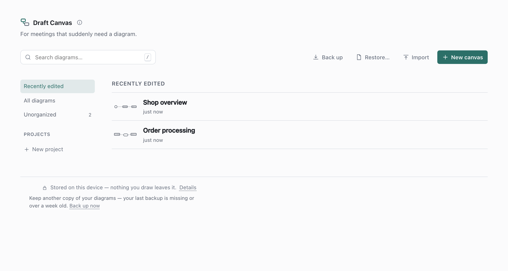
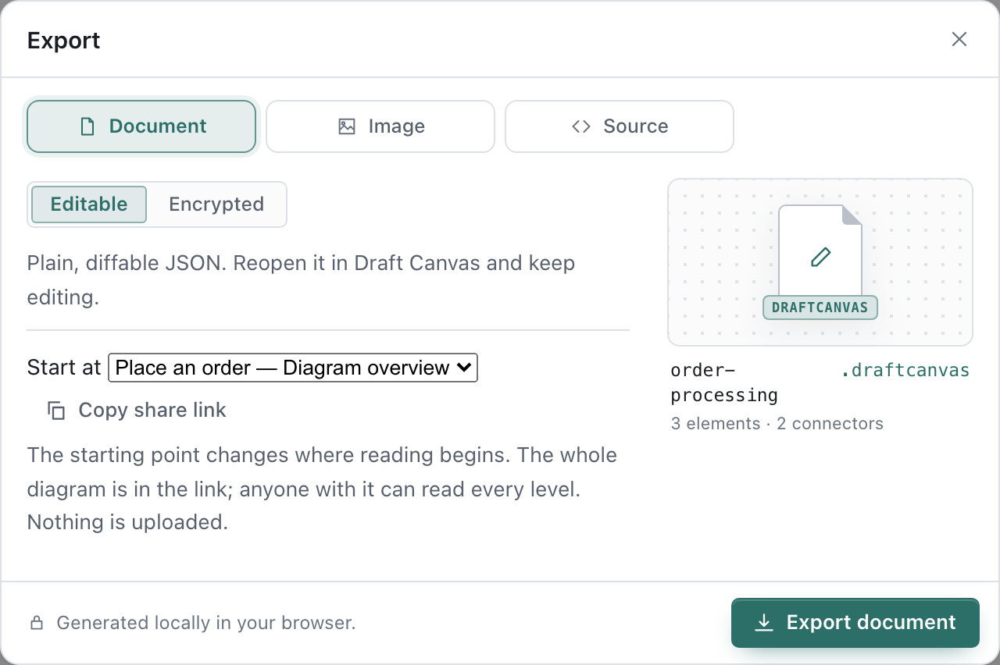

# Saving, backing up and sharing

Draft Canvas saves diagrams in your browser as you draw. This guide separates what happens on its own from what you have to do, because the second list is what
protects you from losing a diagram.

*On the desktop?* The file is the storage there, and none of this applies. See
[Draft Canvas Desktop](desktop.md).

## What happens on its own

- **Autosave.** About 0.7 seconds after you stop editing, the diagram is written to this browser's
  local database (IndexedDB). If you never pause, it still writes at least every 4 seconds. The
  status bar says **Saved locally** when it has. You will only see **Saving…** if a write is slow.
- **Where you left off.** Moving the canvas is saved too, so a diagram reopens where you left it.
- **Leaving.** Closing the tab, reloading, or switching away flushes a final save. That is
  best-effort: a browser can end a page before storage finishes, so don't rely on it for work you
  can't redraw. Going **Back to your diagrams** waits for the save and tells you if it failed.
- **Plain records.** Diagrams are stored as plain records in the browser's own database, readable by
  anything that can read this browser profile — the same as a file in your user folder. Earlier
  versions encrypted them with a key kept in the same profile; those diagrams still open, and are
  saved plain the next time you edit them. [Privacy](../reference/privacy.md) and
  [SECURITY.md](../../SECURITY.md#browser-storage) say what that encryption did and why it was
  retired. A diagram that must be protected at rest is a passphrase-encrypted export, below.
- **Two tabs, one diagram.** If you edit the same diagram in two tabs, the second tab to save is
  stopped and the status bar asks which copy to keep: **Keep mine** or **Load the other tab's**.
  Nothing is overwritten until you choose.

## Import and Export

Use **Import** on Home or in the Library to open a portable file. Use **Export → Document → Editable**
to download a `.draftcanvas` copy you can reopen, move to another device, or commit to a repository.
An export is a snapshot: export again to keep a new file copy of later edits. Browser autosave keeps
your local diagram up to date while you work.

## What you have to do

- **Back up anything you'd mind losing.** Diagrams live in one browser profile on one device. Clearing
  site data for this site deletes them. There is no recovery: Draft Canvas has no server, so it has no copy.
  **Back up** on the Library screen writes every diagram to one `draft-canvas-backup-<date>.zip` — a
  plain `.draftcanvas` file per diagram, plus `projects.json` with your project folders — and
  **Restore…** reads one back. Restoring never overwrites: a diagram whose id is already in the
  Library arrives as a copy, so an old backup can be restored over a Library that has moved on.
  When the browser hasn't promised to keep your data and no backup has been made for a week, the
  footnote under the list says so and offers one.
- **Move a diagram to another browser or machine.** Export it there, import it here. A diagram
  made in Chrome is not in Safari, and private windows usually discard their storage when closed.
- **Use HTTPS for offline.** Browsers install the offline cache only on HTTPS or `localhost`. Served
  over plain `http://` from another machine, Draft Canvas saves normally but needs the network to load.

If the browser blocks storage altogether (some private modes and embedded browsers), the status bar
reads **In memory only** and a message explains it. Work in that state disappears when the tab
closes, so export before you leave.

## Reopening a diagram

The Library is the list of everything saved in this browser. Click a diagram to open it. **Search
diagrams…** (press `/` to jump to it) finds diagrams by title or project name, not by what is drawn
in them.



The Library also lets you rename, duplicate, delete, and move a diagram into a project. Projects are
flat folders for your own tidiness; a diagram is in at most one, and deleting a project moves its
diagrams back to **Unorganized** rather than deleting them.

## Export a file

Open **Export** (`⌘⇧E`, or `Ctrl+Shift+E`; `⌘E` also works), or run **Export…** from the
command palette. The dialog has four modes (Document comes in two kinds):

| Mode | You get | Good for |
| --- | --- | --- |
| **Document → Editable** | `.draftcanvas`: plain, diffable JSON | Backups, moving diagrams, keeping one in a repository |
| **Document → Encrypted** | `.dcenc`: locked with a passphrase | Sending a diagram somewhere you don't control |
| **Image** | PNG or SVG, optionally with the diagram inside | Slides, docs, chat |
| **Source** | Mermaid or PlantUML sequence diagram from a flow; or the architecture as a Mermaid flowchart, C4-PlantUML, Structurizr DSL or a `.drawio` file | Docs that already render those, and other diagram tools |



Notes on each:

- **`.draftcanvas`** holds the whole diagram, including everything you drew inside shapes. A canvas
  background image travels inside the file when it is 2 MB or smaller (the dialog says when one is
  too large to come along), and the file doesn't record which project the diagram was in.
- **`.dcenc`** asks for a passphrase of at least 8 characters, twice. Draft Canvas never stores it and
  can't recover it. If it's lost, the file can't be opened by anyone. It uses its own key, unrelated
  to the one that protects your saved diagrams.
- **Image** offers a **Light** or **Dark** palette, **Transparent**, and **Selection only**.
  PNGs export at 2× unless you pick **1×** or **3×** beside the format — the preview quotes the
  pixel size you will get, and says so if a very large diagram has to be fitted to a smaller scale
  than the one you chose. SVGs are vector. Inside a shape, you choose between that shape's canvas
  and the whole diagram. A diagram with [open points](open-points.md) keeps their markers, with a
  key, unless you untick **Open point markers**.
- **Source** reads either your **Flows** or the **Architecture**. A sequence diagram (Mermaid or
  PlantUML) needs a flow — see [Getting started](getting-started.md#present-a-flow) for making one.
  The architecture formats need nothing but shapes: a **Mermaid flowchart**, **C4-PlantUML** (each
  shape's C4 role follows the view's level, the way the Depth map reads it), **Structurizr DSL** (a
  workspace with a model and views; rooms inside shapes become containers and components) and
  **draw.io** (a `.drawio` file diagrams.net opens with every shape where you left it, boundaries as
  containers, one page per room). The panel shows the generated text itself, so what you see is
  what the file gets. Sequence diagrams have no notation for open points, so those are left out.

Files are named from the diagram's title: `Payment Service!` becomes `payment-service.png`.
Exporting happens in your browser; the file goes to your browser's normal download flow and nothing
is uploaded.

### Copy instead of download

Every image and source export can go to the clipboard rather than a file: **Copy** sits beside the
export button in the dialog, and the command palette has **Copy as image** (a PNG, for chat and
slides), **Copy as SVG** (the markup as text, for a README or an editor) and **Copy source as…**
(any of the source formats). Where the browser can't put an image on the clipboard — Firefox, or a
page not served over HTTPS — the file is downloaded instead and the notice says so.

### Editable images

An SVG or PNG can carry the whole diagram inside it: tick **Editable — carries the diagram inside**
on the Image panel (on by default for SVG, off for PNG; the dialog remembers each). The picture is
the same picture to every viewer — the `.draftcanvas` text sits in an SVG `<metadata>` element or
a PNG text chunk that image viewers ignore — and importing that file into Draft Canvas reopens it
as a diagram, every room included. Anyone who has the image has the diagram, so treat an editable
image like a `.draftcanvas` file rather than a screenshot. The background image doesn't travel in
an editable image.

## Import a file

In the Library, choose **Import** and pick a `.draftcanvas`, `.json` or `.dcenc` file — or a Mermaid
flowchart (`.mmd`, `.mermaid`, or a `.md` with a ```` ```mermaid ```` block; see
[Importing a Mermaid flowchart](#importing-a-mermaid-flowchart)). (On a first run, the button is
**Import .draftcanvas**.) Dropping a file onto the Library, or onto an open canvas, imports it the
same way.

- A `.dcenc` file asks for its passphrase first. A wrong passphrase is reported and nothing is
  imported.
- If you already have a diagram with the same id, for example because you exported it from this
  browser, the import arrives as a new diagram; the existing one is never overwritten.
- Imported diagrams open straight away and are saved like any other. They are not put in a project.

### Repairs, limits and compatibility

Draft Canvas repairs rather than refuses. A file with a few broken connectors opens with the rest
intact, and a message lists what was dropped, for example *Imported with repairs: Dropped 3
connector(s) pointing at nodes that do not exist.* Content past the size limits (5,000 shapes,
10,000 connectors, 50 flows, 3 levels of nesting inside shapes) is trimmed the same way, and files
over 24 MB are refused.

Files carry a format version. The rules are:

- **Older file, newer app:** it upgrades when opened. The file you picked isn't modified; the upgraded
  copy is what gets saved in the Library.
- **Newer file, older app:** it is refused with a message like *This file was made with a newer version
  of Draft Canvas*, rather than opened and quietly stripped. Reload the page to get the current
  version. An installed offline copy can lag until it reloads.
- **A file that isn't a Draft Canvas document** is refused with an explanation.

The full contract is in the [schema reference](../reference/schema.md).

### Importing a Mermaid flowchart

A Mermaid `flowchart` or `graph` becomes an editable diagram: pick the file in the Library's
**Import**, drop it onto the Library or a canvas, or paste the text (⌘V / Ctrl+V) onto an open
canvas. A file opens as a new diagram named after the file (a `title:` line in Mermaid front matter
wins). Pasted or dropped text lands in the diagram you are editing, beside what is already drawn,
selected, as one step — ⌘Z removes all of it. Draft Canvas lays the result out itself; the
positions Mermaid would have chosen are not part of the text.

What maps:

| Mermaid | Draft Canvas |
| --- | --- |
| `[text]`, `(text)`, `([text])`, `>text]`, `[/text/]`, `[\text\]` and the trapezoids | Service |
| `[(text)]` cylinder | Data Store |
| `[[text]]` subroutine | Queue |
| `((text))`, `(((text)))` circle | Person (an actor) |
| `{text}`, `{{text}}` decision | Junction, carrying the text |
| `-->`, `==>`, and their longer spellings | Connector |
| `---` (no head) | Undirected connector |
| `-.->` dotted | Asynchronous connector |
| `-->\|label\|`, `-- label -->`, `-. label .->`, `== label ==>` | Connector label |
| `A --> B --> C`, `A & B --> C` | Each arrow in the chain or fan |
| `subgraph id [Title] … end`, nested | Boundary, nested |
| `TD`/`TB` and `LR` | The reading direction of the layout |
| `"quoted"` labels, `<br>` line breaks, `#quot;`-style entities | The text, as Mermaid shows it |
| `%%` comments, a ```` ```mermaid ```` fence in Markdown | Ignored and unwrapped |

What is skipped is named in one message before the diagram opens (*Imported — 3 things Mermaid said
that Draft Canvas doesn't draw: classDef, style, click*): `classDef`, `class`, `:::class`, `style`,
`linkStyle`, `click`, `accTitle`/`accDescr`, `direction` inside a subgraph, `@{ shape: … }` node
syntax (drawn as a plain shape), invisible `~~~` links, arrows to or from a subgraph itself, circle
and cross arrowheads (drawn as plain arrows), two-headed arrows (drawn one way), `RL` and `BT`
(drawn left to right and top to bottom), and HTML inside labels (the tags are removed). Other Mermaid
diagram kinds (`sequenceDiagram`, `classDiagram`, …) are refused with a message naming the kind.

A flowchart is one import's worth of work: up to 300 shapes, 600 arrows and 60 subgraphs, labels
up to 120 characters (80 on arrows and subgraphs; longer ones are shortened), and text up to 512 KB.
Past any of these the import is refused with the limit it hit, so a hostile file is never laid out.

## Share a diagram

There are no accounts and no server, so sharing means handing someone the diagram itself. Pick
whichever of these fits:

- **Send a link.** Run **Copy share link** from the command palette (`⌘K`), or open **Export →
  Document** and press **Copy share link**. The whole diagram — every room inside a shape included —
  is compressed into the link itself, after the `#`; nothing is uploaded anywhere. Whoever opens it
  sees the diagram **read only**: a banner says so, the title can't be changed, the create tools are
  gone, and nothing they type or drag changes it. **Make an editable copy** in that banner saves it
  into their own Library as a new diagram, and from there it's theirs to edit. The link is a copy, not
  a connection: edits you make later don't reach it, and theirs don't reach you.

  Anyone who has the link has the diagram, as plainly as if you had sent the file, and the link
  never expires — there's no server to expire it. Chat apps and browsers keep links, and some fetch
  them to draw previews. For anything you wouldn't paste into a chat as text, send a `.dcenc` file
  instead. A link holds up to 32 KB of compressed diagram, which covers most; a diagram past that is
  told so and asked to export a file. The background image doesn't travel in a link.
- **Send the file.** A `.draftcanvas` is readable by anyone who has it, and opens in the hosted app,
  a self-hosted copy, or the desktop app. For anything you wouldn't send as plain text, use `.dcenc` and send
  the passphrase by a different route.
- **Put it in the repository.** `.draftcanvas` is stable JSON with a fixed field order, so an unchanged
  diagram produces identical bytes and edits show up as small diffs in review.
- **Send a picture.** PNG for chat and slides, SVG for docs — or **Copy as image** straight into a
  chat. An [editable image](#editable-images) is a picture the recipient can import and keep
  editing. For a moving walkthrough, present the flow live or screen-record it; there is no
  animated export.
- **Copy shapes between diagrams.** `⌘C` on a selection and `⌘V` in another diagram, even in another tab,
  brings shapes and their connectors along. Copying puts them on your system clipboard as text, and
  the app reads the clipboard only when you paste. The first time you use **Paste** from the context
  menu or command palette, Draft Canvas asks before reading it. `⌘V` doesn't need to.

## If something looks wrong

- **A diagram is in the Library but won't open** ("That diagram could not be read from local
  storage"). The stored record is corrupted, or it was saved encrypted by an earlier version and the
  browser's copy of the key is gone. The Library can still list it because the title is stored
  separately, but there's no way to recover what was drawn. If you exported a file, import that.
- **The Library is empty.** Diagrams are per browser profile and per origin: `localhost:5180`, a
  Docker copy on `:8080` and the hosted site each keep their own. Check you're on the same one, and not
  in a private window.
- **"This browser is out of local storage space."** Delete a diagram you no longer need, or export
  this one first.
- **Saving stopped and says another tab updated Draft Canvas.** Export your recent changes, then
  reload.

## Choose where a shared explanation begins

Open **Share from here…** in the command palette, or use the share controls in Export's document
view. **Start at** offers **Diagram overview**, **Current level**, and playable flows labelled with
their location. It defaults to the selected playable flow, then the current nested level, then the
overview. The quick **Copy share link** command always starts at the overview.

A flow link opens read-only at its introduction; the reader advances it themselves. They may explore
or make an editable copy. The starting point changes where reading begins, not what is shared:
**the link still contains the whole document**. Old links work as before. An unavailable level or
flow falls back to the overview with a notice. The starting metadata counts toward the link-size limit.

## Checking backups and reporting a failure

The Library reminds you when your last backup is missing or over a week old, including when the
browser has granted persistent storage. A partial backup keeps readable diagrams but says how many
could not be read; it does not count as a complete backup. Keep an earlier backup until the problem
is resolved. Browser persistence does not protect against clearing site data or losing the device.

For a problem report, open About → **Diagnostic report…**, review the displayed JSON, and choose
**Download report**. It includes recent failure categories and versions, excluding diagram content
and file paths. It is never sent automatically. Saving and recovery limits are explained in
[reliability](../reference/reliability.md#recovery-guarantees-and-limits).
