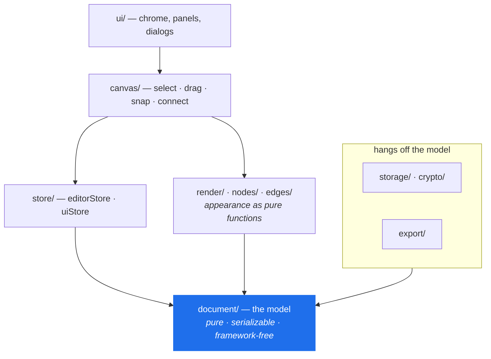
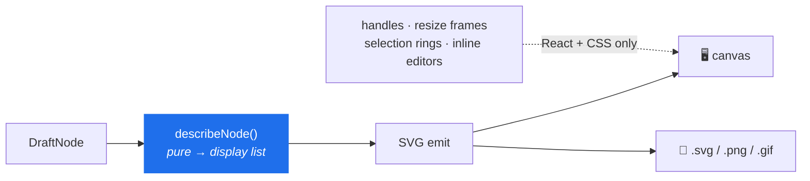
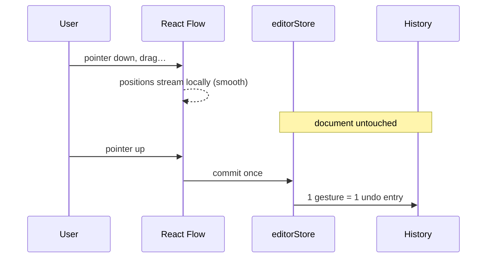
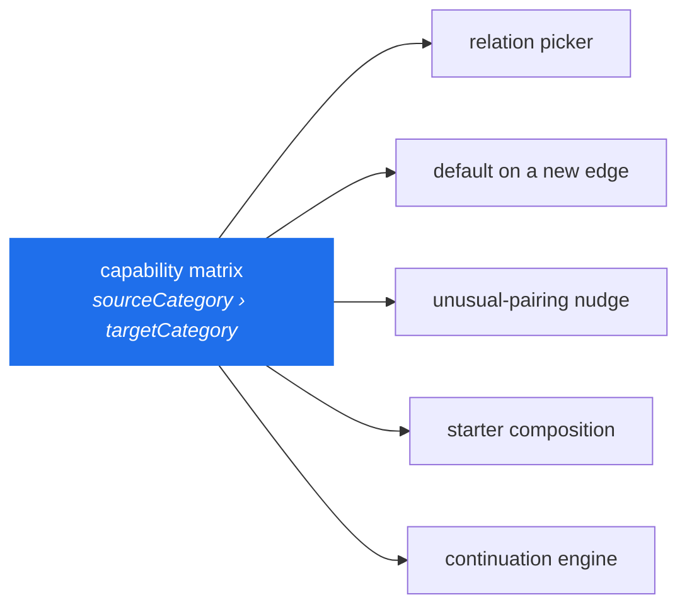
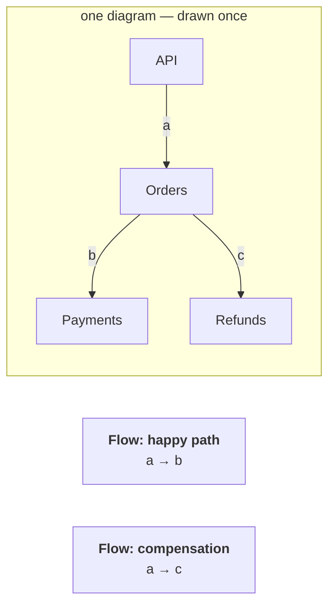
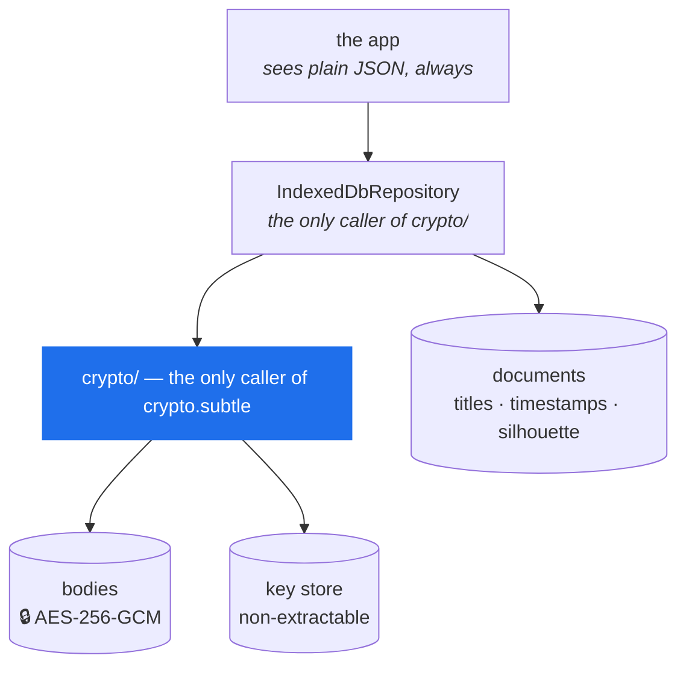
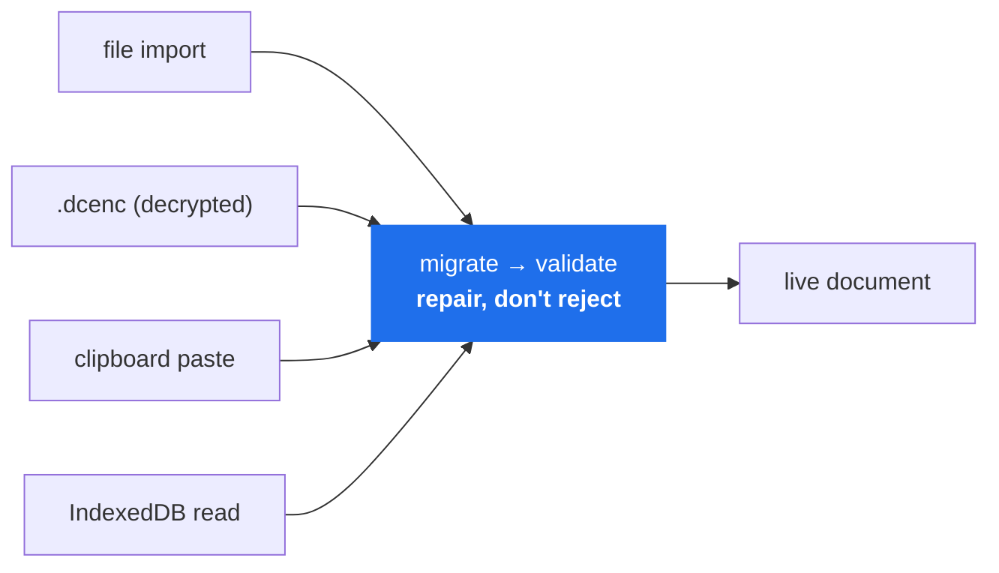

# Architecture

> **The one-sentence version:** a serializable document model with a pure renderer bolted to it —
> everything else is a view.

| Looking for | Go to |
| --- | --- |
| Why it's built this way | this document |
| What it understands about a diagram | [`semantics.md`](semantics.md) |
| The file format and migrations | [`schema.md`](schema.md) |
| "Never break this" | [`AGENTS.md`](../../AGENTS.md) |
| Threat model and keys | [`SECURITY.md`](../../SECURITY.md) |

---

## The problem

Someone is in a meeting that suddenly needs a diagram. A few minutes, no appetite for a login
screen, a rough architecture in their head.

```
speed          over   completeness
opinion        over   configurability
throwaway      but    exportable without disappointment
```

---

## Principles

| # | Principle | What it buys |
| --- | --- | --- |
| 1 | **The document is the product** | The code is one reader of it. A file drawn today outlives every framework decision above it. |
| 2 | **Local-first is enforced, not promised** | A test fails on any network primitive in `src/`; the CSP makes cross-origin requests impossible. |
| 3 | **One renderer** | Screen and export are the same drawing, not two that agree most of the time. |
| 4 | **Model meaning, not technology** | Component, Adapter, Queue — never Kafka, Spring, Lambda. |
| 5 | **Suggest, never block** | Rules narrow and propose. None forbids. |
| 6 | **Derived beats stored** | Nothing recomputable earns a migration, a validator and an undo entry. |
| 7 | **Deterministic, not clever** | Same document + selection → same answer. No model, no network, no adaptation. |
| 8 | **Degrade, never destroy** | Worst case is a smaller diagram, never a lost one. |
| 9 | **One surface per capability** | Palette, context menu and shortcut are three names for one store action. |

Two of these carry their own test before they're allowed to be called true:

- **#4's admission test** — *if every technology in this architecture were replaced, would the
  concept still make sense?* Component, Adapter, Datastore, Queue: yes. Kafka, PostgreSQL, Lambda:
  no. A technology name is a label a user types onto a primitive, never a reason to add one.
- **#2's build test** — `tests/privacy.test.ts` greps the app's own source for `fetch`,
  `XMLHttpRequest`, `WebSocket`, `sendBeacon`, `eval`. See [`privacy.md`](privacy.md).

---

## Shape of the system



**Every arrow points down toward `document/`, and `document/` points at nothing.** It imports
neither React nor React Flow. That single rule is what makes the file format survivable.

| Area | What lives there |
| --- | --- |
| `document/` | types · operations · flow · semantics · validate · migrate · limits |
| `render/` | text layout · code highlighting · SVG emit · PNG rasterize · theme |
| `nodes/`, `edges/` | appearance as pure functions; routing and bundling |
| `canvas/` | the React Flow surface, projection, snapping, spatial nav |
| `store/` | `editorStore` (the document) · `uiStore` (ephemeral UI) |
| `storage/`, `crypto/` | persistence, autosave, encryption at rest |
| `commands/` | one registry the palette, menu and shortcut sheet all read |
| `depth/` | the tree of rooms a shape can hold (`tree.ts`) and the view level each one shows (`level.ts`) |
| `starters/` `continuation/` `sequence/` `presentation/` | capabilities derived from the model |
| `learn/` · `ui/learn/` | the Learn handbook: recipes, search and scene data (pure) · the drawer and scene renderer (its own lazy chunk) |
| `export/` | `.draftcanvas` / `.dcenc` files, SVG, PNG, GIF, sequence diagrams, and the seam that saves a download |
| `history/` | the undo/redo stack |
| `takeaways/` | actions, decisions and questions derived from a diagram's notes |
| `host/` | the protocol with a host that owns the file — VS Code or the desktop app ([Desktop](#desktop)) |
| `desktop/` | the desktop app's own screens and its only route to Tauri (`desktop/tauri/`), compiled out of the web build |
| `ui/` · `lib/` · `releases/` | everything around the canvas · small shared utilities and preferences · What's New data |

Library and editor are two states of one screen (`src/App.tsx`, no router) — which is why the build
can be served from any path.

---

## One renderer

Principle #3, drawn:



Interactive chrome lives in React/CSS *specifically* so it can never leak into an exported image.
Text wraps in exactly one module; a second wrapper would agree most of the time, which is worse
than not agreeing at all.

> ⚠️ **Connectors are the exception.** On-screen and exported edges are two independent
> implementations. Nothing enforces parity — a new badge, dash or chip must be added in **both**.
> `e2e/line-jumps.spec.ts` closes the seam for one visual by comparing the two in a real browser,
> which is the only place both renderers exist at once; the rest are still on trust.

---

## The canvas boundary



The store owns the document; React Flow is a *controlled view*, projected during render. The
document never carries half-finished state.

---

## Core concepts

### The document model

Plain data. Closed enums. No functions. Since v12 it is a *tree* of graphs rather than one: a node
may own the architecture that runs inside it, which is how a diagram can stay at one altitude and
still have the detail somewhere. Owning it rather than pointing at it is what makes the reference
unbreakable — deleting or copying a shape takes its rooms with it, and a cycle cannot be expressed. Every mutation in `document/operations.ts` is a pure
function returning a new document that **reuses untouched nodes** — that structural sharing is what
makes snapshot history affordable and "what changed?" answerable by identity.

### Relationship model

One capability matrix, keyed by the categories of the two endpoints, is the single source of truth
for what a connection probably means.



Deliberately **sparse** — an undocumented pairing keeps full freedom. The matrix being *one* thing
is what makes the rest safe: a starter can't state a relationship the inspector would disagree
with, and a suggestion can't propose a pairing the app wouldn't have inferred itself. Rules:
[`semantics.md`](semantics.md).

### Flows and presentation

A flow **narrates connectors that already exist** — it orders *references*, never copies.



So two flows share early steps and diverge later, and one diagram carries both stories. Playback,
the lens, step badges, GIF export and sequence export are all readings of that same ordered list.

Moving *between* flows is the same reading again: `nextFlow`/`previousFlow` are `pickFlow` with a
different index into the document's own `flows` order, so a switch is a fresh start at the
destination's step 1 and there is no second ordering to keep in step. It never wraps — the end of
the last flow is the end of the walkthrough, not a loop back to the first.

A flow is told in three kinds of moment (`FlowPlaybackState.stage`): the *opening* frames the
whole flow under its title before step 1, each *step* frames one interaction, and the *closing*
returns to the whole path after the last. The overviews light every member at once (`shown`, via
`edgeTierInPlayback`/`nodeTierInPlayback` in `document/flow.ts`); a step lights one interaction and
plays its signal — one stroke along the active connector's own drawn path (`DraftEdgeView`'s
`.dc-signal`, keyed per transition so it plays once and never finishes late), then stillness. The
camera is directed, not centred: `presentation/composition.ts` says what a step is a picture of
(its shapes, the connector as drawn, a boundary it crosses) and `presentation/framing.ts` decides
whether the camera holds, slides or cuts to show it — pure functions, tested on their own — while
`useFlowPlayback` judges against the camera it *asked for* when a move is still in flight, so a
burst of presses converges. A presenter's own pan or zoom sets `uiStore.presentation.framing` to
`'manual'` and the camera is theirs until they ask for it back. Nothing here reads the document as
anything but authored steps: no timing, no outcome, no execution is inferred.

While a flow plays, the step's attachments tell the story beside it. The pipeline is derived, not
scheduled: step → who speaks (`presentation/presentationAttachments.ts`: the step's connectors,
spotlighted nodes, then the node a connector first arrives at) → presence (current callout plus at
most one leaving, `canvas/presentation/useCalloutPresence.ts`) → `PresentationCallout`, which
anchors to the chip or badge in flow space and places itself in screen space
(`presentation/calloutPlacement.ts`) through the same `useOverlayPosition` every canvas popover uses.

### History

Snapshot-based over the shared-structure model. A gesture brackets into one entry; entries in the
same continuous edit merge, so typing a name is one undo. Viewport changes persist but are never
recorded — moving the camera is not an edit.

### Persistence and the crypto boundary



The two-store split is what lets the library list itself without deserializing — or decrypting — a
single canvas. The fingerprint drawn as a library thumbnail is **silhouettes, never words**.

Every content write mints a stamp, and an open editor's save is checked against the stamp it last read:
a different one means another tab saved other content, and the user is asked which copy to keep. A
**camera move** is saved too — a diagram reopens where it was left — but it is not content
(`SaveOptions.cameraOnly`): it keeps the stamp it found, and if the stored copy has moved on it is
dropped without complaint, so looking around in one tab never makes another tab's next edit
conflict, and never overwrites anything.

Failure posture: a failed decrypt never overwrites the only copy; no IndexedDB falls back to memory
and says so plainly.

### Untrusted input and schema evolution



One door, no second less-careful path. A diagram with three broken edges opens with the other
ninety-seven intact and reports what it dropped. Enums whitelisted, coordinates clamped, ids
de-duplicated, cycles detached — colour is an enum, so no user string ever reaches an SVG `fill`.

Version numbers are read in exactly one place. A newer file is refused *by name*; an older one
walks one function per transition. Contract: [`schema.md`](schema.md).

### Derived capabilities

Six features are best understood as **derivations of the model** — that framing is what keeps them
from becoming separate systems.

| Capability | Derives | The rule that keeps it honest |
| --- | --- | --- |
| **Starters** | opening compositions → ordinary nodes/edges/flows | Composition is authored; relationships come from the matrix; nothing sets appearance. No document records that a node came from one. |
| **Intent Continuation** | one node + its neighbourhood → ranked next moves | Validity is the matrix. Confidence is derived, never authored; only high confidence shows unprompted. Ranking is a few named signals over declaration order. Only the showing candidate is materialized, and the preview *is* the result. Silence is the default, but never the answer to asking: where no guess is made on purpose, `ambiguity.ts` says why, and `]` opens the picker with that reason. |
| **Sequence export** | every playable flow → one Mermaid/PlantUML file | An export format, not a mode. Responsibility ends at correct, deterministic text. |
| **Commands** | selection + mode + document → what makes sense now | Re-derived, never registered. Each one calls an existing store action. |
| **Depth** | a node's `inside` + where you are standing → the room being edited | One seam (`depth/tree.ts` + the store's `path`): everything else still edits a plain document. A room exists exactly when it holds a shape, so navigating writes nothing. A level is stored only when someone said it; what the rooms inside show follows from it, and is never written down. |
| **Takeaways** | the notes already on the canvas + one root-level list → what the meeting produced | Only `actions` is stored. Decisions and open questions are `note` nodes and note attachments tagged `decision`/`question`, gathered from every room — so a diagram drawn before this existed has something to show, with no migration. `warning` stays out: it annotates the architecture, not the discussion. |

### Keyboard model

One handler, one focus model, one source of truth for shortcut strings. The canvas is **a single
Tab stop**, not a few hundred — selection is the keyboard-focus indicator, a virtual-focus model
that scales. Shortcut strings live on the commands themselves, and a test cross-checks the shortcut
sheet against the registry in both directions.

---

## The two seams

Both are knowing departures from the principles above, and both bite silently:

| Seam | Failure mode |
| --- | --- |
| Two independent connector renderers | A visual added on-screen is missing from every export, and nobody notices for weeks. |
| Side effects inside a React state updater | Dev mode runs updaters twice — this once recorded every drag twice and made undo look broken. |

---

## Testing posture

Organized around guarantees, not modules: the model and its operations · round-tripping and
migration · hostile imports · undo granularity · storage failure modes · text layout and SVG
escaping · the privacy claim · performance at scale · and one browser run of the whole journey —
build, connect, undo, reload, export, delete, import, edit.

> **Anything this document calls a principle should have a test that fails when it stops being
> true.**

---

## Desktop

The desktop app is a third *host* for the same editor, not a second editor. There is one React
application; what differs is who owns the document.

| Host | The document lives in | It talks to the app through |
| --- | --- | --- |
| Web | the browser (IndexedDB, `DraftRepository`) | nothing: the app owns it |
| VS Code | the `.draftcanvas` file, owned by the extension, which frames the hosted editor (`APP_URL` in `vscode-extension/src/extension.ts`) rather than bundling it | `postMessage` across the webview's frame |
| Desktop | the `.draftcanvas` file, owned by the desktop shell | the same messages, in the same page |

A host that owns a file speaks the protocol in `src/host/embeddedHost.ts`: it sends the file's text, the app
sends back every committed edit as the whole serialized document, and saving is the host's. `useHostDocument`
is the app's side of that conversation and knows only a `HostChannel` (`src/host/channel.ts`). VS Code's
channel is the frame; the desktop's (`src/desktop/channel.ts`) hands the message across in-process.

The other end of the desktop's channel is `DesktopController` (`src/desktop/controller.ts`), which plays the
part of VS Code's extension: it knows what file is open, whether it has unsaved changes, and how to save it,
and it keeps a recoverable copy of any work that isn't in a file yet. It has no React and no Tauri in it, and
talks to the shell only through the `DesktopApi` interface (`src/desktop/api.ts`). Exactly one module
implements that interface with Tauri calls, `src/desktop/tauri/`, and a test fails if any other imports
`@tauri-apps/*`. The web build is compiled with `__DESKTOP__` false and contains none of it.

The Rust side (`src-tauri/`) is small on purpose. It does what a web page can't: windows, the tray and the
menu bar, native dialogs, single-instance and file association, and file writes that survive a crash. It never
sees a diagram's contents as anything but bytes (apart from the id and title an AI agent's broker reads to
find diagrams, when agents are turned on), and the app never holds a path: the shell hands out opaque
handles for files and folders the user picked (or the OS opened) and accepts only those back, so no path that
didn't come from the user can be read or written.

The browser's storage is untouched. `DraftRepository`, `Autosave` and the encrypted IndexedDB store are the web
host's, and the desktop app doesn't open them: a file the user picked is only ever written by an explicit
Save, and unsaved work goes to recovery copies in the app's own data folder. The one exception is an AI agent
the person allowed (below), whose change to a document with no unsaved changes is saved for it.

### AI agents

When the person turns it on, the desktop app also answers a local MCP connector (`src-tauri/mcp/`, a separate
binary an agent launches). The connector forwards tool calls over a user-only socket to a broker in the shell
(`src-tauri/src/agent/`), which works as follows:

- **Scope.** It checks access and folder scope. For this alone, the shell reads diagrams in the folders the
  person allowed, as far as their `metadata.id` and title, to find and list them.
- **Ledger.** It keeps the request ledger that makes retries safe.
- **Forwarding.** It passes each request to the page as a `HostEvent`.
- **The gate.** The page must pass a commit gate before it changes anything, so a request that timed out can
  never be applied late.

The page does the diagram work in `src/agent/` (validation, patching, reads) and `src/layout/` (a deterministic
layered layout). Heavy work runs on a worker thread, measuring text the way the canvas does. An edit then
reaches the open document through the same store and undo history as a manual one (`applyToFile`, one undo
step). A new diagram is written by the shell with `create_new`, so it never replaces a file.

`src/agent/` and `src/layout/` import no React. C4 role and scope are derived by `src/depth/c4.ts`, shared with
the editor. The design, the guarantees, and what isn't supported: [Agent integration](agent-integration.md).

---

## Deliberately not built

```
accounts · cloud sync · collaboration · comments
AI generation · template galleries · cloud-provider icon packs
```

Each would be a reasonable product; none of them is this one.

Kept out of the way rather than designed for: Mermaid import, image nodes, PWA install.
